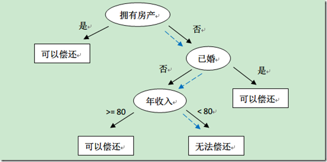
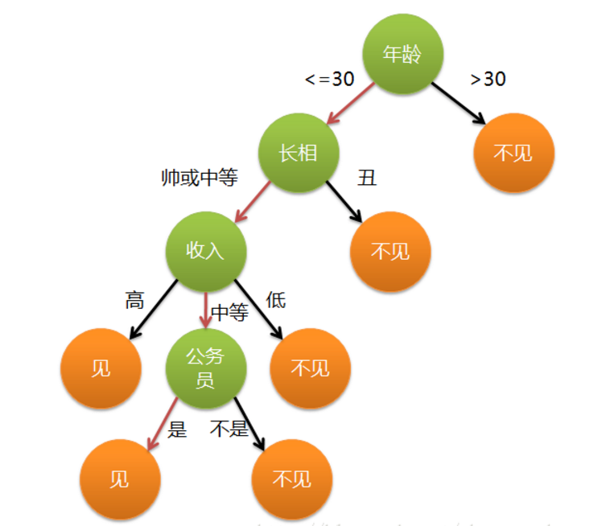

# 决策树

<!-- more -->

## 1、决策树概述

决策树是属于有监督机器学习的一种，起源非常早，符合直觉并且非常直观，模仿人类做决策的过程，早期人工智能模型中有很多应用，现在更多的是使用基于决策树的一些集成学习的算法。这一章我们把决策树算法理解透彻了，非常有利于后面去学习集成学习。

### 1.1、示例一

我们有如下数据：

| ID  | 拥有房产（是/否） | 婚姻[单身，已婚，离婚] | 年收入（单位：千元） | 无法偿还债务（是/否） |
| --- | ----------------- | ---------------------- | -------------------- | --------------------- |
| 1   | 是                | 单身                   | 125                  | 否                    |
| 2   | 否                | 已婚                   | 100                  | 否                    |
| 3   | 否                | 单身                   | 70                   | 否                    |
| 4   | 是                | 已婚                   | 120                  | 否                    |
| 5   | 否                | 离婚                   | 95                   | 是                    |
| 6   | 否                | 已婚                   | 60                   | 否                    |
| 7   | 是                | 离婚                   | 220                  | 否                    |
| 8   | 否                | 单身                   | 85                   | 是                    |
| 9   | 否                | 已婚                   | 75                   | 否                    |
| 10  | 否                | 单身                   | 90                   | 是                    |

上表根据历史数据，记录已有的用户是否可以偿还债务，以及相关的信息。通过该数据，构建的决策树如下：



比如新来一个用户：无房产，单身，年收入 55K，那么根据上面的决策树，可以预测他无法偿还债务（蓝色虚线路径）。从上面的决策树，还可以知道是否拥有房产可以很大的决定用户是否可以偿还债务，对借贷业务具有指导意义。

### 1.2、示例二

女孩母亲要给她介绍对象，年龄是多少，母亲说 24。长得帅吗？挺帅的。收入高吗？中等收入。是公务员吗？母亲说，是的。女孩：好，我去见见。

根据**实力**构建决策树：



问题：图片是二叉树吗？

决策树是标准的二叉树，每个节点只有两个分支~

- 上面那棵树中，属性：绿色的节点（年龄、长相、收入、是否是公务员）
  - 属性叫做，data，数据，一般使用 X 表示
  - 跟属性对应，目标值（橘色节点），一般使用 y 表示
- 构建这棵树时，先后顺序，每个人，标准不同，树结构不同
- 计算机，构建树，标准一致的，构建出来的树，一致

### 1.3、决策树算法特点

- 可以处理非线性的问题
- 可解释性强，没有方程系数 $\theta$
- 模型简单，模型预测效率高 if else

## 2、DecisionTreeClassifier 使用

### 2.1、算例介绍


其中 s、m 和 l 分别表示小、中和大。

账号是否真实跟属性：**日志密度、好友密度、是否使用真实头像**有关系~

### 2.2、构建决策树并可视化

数据创建

```Python
import numpy as np
import pandas as pd
y = np.array(list('NYYYYYNYYN'))
print(y)
X = pd.DataFrame({'日志密度':list('sslmlmmlms'),
                  '好友密度':list('slmmmlsmss'),
                  '真实头像':list('NYYYYNYYYY'),
                  '真实用户':y})
X
```

模型训练（报错，原因：数据类型是字符串）

```Python
from sklearn.tree import DecisionTreeClassifier

model = DecisionTreeClassifier()

model.fit(X,y)
```

数据修改（map 函数，进行数据转换）

```Python
X['日志密度'] = X['日志密度'].map({'s':0,'m':1,'l':2})
X['好友密度'] = X['好友密度'].map({'s':0,'m':1,'l':2})
X['真实头像'] = X['真实头像'].map({'N':0,'Y':1})
X
```

模型训练可视化

```Python
import matplotlib.pyplot as plt
# 使用信息熵，作为分裂标准
model = DecisionTreeClassifier(criterion='entropy')
model.fit(X,y)
plt.rcParams['font.family'] = 'STKaiti'
plt.figure(figsize=(12,16))
fn = X.columns
_ = tree.plot_tree(model,filled = True,feature_names=fn)
plt.savefig('./iris.jpg')
```


数据可视化另一种方式，[安装教程](https://blog.csdn.net/Soft_Po/article/details/118899477)

```Python
from sklearn.datasets import load_iris
from sklearn.tree import DecisionTreeClassifier
import graphviz
from sklearn import tree
model = DecisionTreeClassifier(criterion='entropy')
model.fit(X,y)
dot_data = tree.export_graphviz(model, out_file=None,
                            feature_names= X.columns,# 特征名
                            class_names=np.unique(y),# 类别名
                            filled=True, # 填充颜色
                            rounded=True) # 圆角
graph = graphviz.Source(dot_data)
graph.render('Account',format='png')
```

修改中文乱码

```Python
import re
# 打开 dot_data.dot，修改 fontname="支持的中文字体"
f = open('Account', 'r', encoding='utf-8')
with open('./Account2', 'w', encoding="utf-8") as file:
    file.write(re.sub(r'fontname=helvetica', 'fontname=Fangsong', f.read()))
f.close()
# 从文件中加载，展示
graph = graphviz.Source.from_file('./Account2')
graph.render('Account')
```


### 2.3、信息熵

- 构建好一颗树，数据变的有顺序了（构建前，一堆数据，杂乱无章；构建一颗，整整齐齐，顺序），用什么度量衡表示，数据是否有顺序：信息熵
- 物理学，热力学第二定律（熵），描述的是封闭系统的混乱程度

  

- 信息熵，和物理学中熵类似的

  

  <font size = 5>$H(x) = -\sum\limits_{i = 1}^n p(x)log_2p(x)$</font>

- <font size = 5>$H(x) = \sum\limits_{i = 1}^n p(x)log_2\frac{1}{p(x)}$</font>

### 2.4、信息增益

信息增益是知道了某个条件后，事件的不确定性下降的程度。写作 g(X,Y)。它的计算方式为熵减去条件熵，如下

$g(X,y) \rm = H(Y) - H(Y|X)$

表示的是，知道了某个条件后，原来事件不确定性降低的幅度。

### 2.5、手动计算实现决策树分类

数据整合

```Python
X['真实用户'] = y
X
```

计算未划分信息熵

```Python
s = X['真实用户']
p = s.value_counts()/s.size
(p * np.log2(1/p)).sum()
```

按照日志密度进行划分

```Python
x = X['日志密度'].unique()
x.sort()
# 如何划分呢，分成两部分
for i in range(len(x) - 1):
    split = x[i:i+2].mean()
    cond = X['日志密度'] <= split
    # 概率分布
    p = cond.value_counts()/cond.size
    # 按照条件划分，两边的概率分布情况
    indexs =p.index
    entropy = 0
    for index in indexs:
        user = X[cond == index]['真实用户']
        p_user = user.value_counts()/user.size
        entropy += (p_user * np.log2(1/p_user)).sum() * p[index]
    print(split,entropy)
```

筛选最佳划分条件

```Python
columns = ['日志密度','好友密度','真实头像']
lower_entropy = 1
condition = {}
for col in columns:
    x = X[col].unique()
    x.sort()
    print(x)
    # 如何划分呢，分成两部分
    for i in range(len(x) - 1):
        split = x[i:i+2].mean()
        cond = X[col] <= split
        # 概率分布
        p = cond.value_counts()/cond.size
        # 按照条件划分，两边的概率分布情况
        indexs =p.index
        entropy = 0
        for index in indexs:
            user = X[cond == index]['真实用户']
            p_user = user.value_counts()/user.size
            entropy += (p_user * np.log2(1/p_user)).sum() * p[index]
        print(col,split,entropy)
        if entropy < lower_entropy:
            condition.clear()
            lower_entropy = entropy
            condition[col] = split
print('最佳列分条件是：',condition)
```


进一步列分

```Python
cond = X['好友密度'] < 0.5
X_ = X[cond]
columns = ['日志密度','真实头像']
lower_entropy = 1
condition = {}
for col in columns:
    x = X_[col].unique()
    x.sort()
    print(x)
    # 如何划分呢，分成两部分
    for i in range(len(x) - 1):
        split = x[i:i+2].mean()
        cond = X_[col] <= split
        # 概率分布
        p = cond.value_counts()/cond.size
        # 按照条件划分，两边的概率分布情况
        indexs =p.index
        entropy = 0
        for index in indexs:
            user = X_[cond == index]['真实用户']
            p_user = user.value_counts()/user.size
            entropy += (p_user * np.log2(1/p_user)).sum() * p[index]
        print(col,split,entropy)
        if entropy < lower_entropy:
            condition.clear()
            lower_entropy = entropy
            condition[col] = split
print('最佳列分条件是：',condition)
```


## 3、决策树分裂指标

常用的分裂条件时：

- 信息增益
- Gini 系数
- 信息增益率
- MSE（回归问题）

### 3.1、信息熵（ID3）

在信息论里熵叫作信息量，即熵是对不确定性的度量。从控制论的角度来看，应叫不确定性。信息论的创始人香农在其著作《通信的数学理论》中提出了建立在概率统计模型上的信息度量。他把信息定义为“用来消除不确定性的东西”。在信息世界，熵越高，则能传输越多的信息，熵越低，则意味着传输的信息越少。还是举例说明，假设 Dammi 在买衣服的时候有颜色，尺寸，款式以及设计年份四种要求，而 Sara 只有颜色和尺寸的要求，那么在购买衣服这个层面上 Dammi 由于选择更多因而不确定性因素更大，最终 Dammi 所获取的信息更多，也就是熵更大。所以信息量=熵=不确定性，通俗易懂。在叙述决策树时我们用熵表示不纯度（Impurity）。

对应公式如下：

<font size = 5>$H(x) = -\sum\limits_{i = 1}^n p(x)log_2p(x)$</font>

熵的变化越大，说明划分越纯，信息增益越大~

### 3.2、Gini 系数（CART）

基尼系数是指国际上通用的、用以衡量一个国家或地区居民收入差距的常用指标。

基尼系数最大为“1”，最小等于“0”。基尼系数越接近 0 表明收入分配越是趋向平等。国际惯例把 0.2 以下视为收入绝对平均，0.2-0.3 视为收入比较平均；0.3-0.4 视为收入相对合理；0.4-0.5 视为收入差距较大，当基尼系数达到 0.5 以上时，则表示收入悬殊。

基尼系数的实际数值只能介于 0 ～ 1 之间，基尼系数越小收入分配越平均，基尼系数越大收入分配越不平均。国际上通常把 0.4 作为贫富差距的警戒线，大于这一数值容易出现社会动荡。

Gini 系数越小，代表集合中的数据越纯，所有我们可以计算分裂前的值在按照某个维度对数据集进行划分，然后可以去计算多个节点的 Gini 系数。

对应公式如下：

<font size = 5>$\rm gini = \sum\limits_{i = 1}^np_i(1 - p_i)$</font>

在对数据进行分类是 gini 系数的变化越大，说明划分越纯，效果越好~

### 3.3、信息增益率

大学期末的数学考试只有单选题。对于一个完全没有学习过的学生。该如何过关呢？

4 个选项是正确选项的概率都是 1/4。那么单项选择题的答案的熵就是：

$H(Y) \rm = -0.25log_2(0.25) \times 4 = 2bit$

在学霸圈做单项选择题有一个秘籍：三长一短选最短，三短一长选最长。姑且假设学霸的秘籍一般都是正确的。

如果在某场考试中，有 10%的单项选题是三长一短，10%的选题是三短一长。计算该考试单项选题的关于长短题的条件熵：

| 题目类型 |          答案概率           | 题目概率 |
| :------: | :-------------------------: | :------: |
| 三长一短 | (1,0,0,0)熵是 0，结果确定！ |   10%    |
| 三短一长 |       (1,0,0,0)熵是 0       |   10%    |
|  一样长  | (0.25,0.25,0.25,0.25)熵是 2 |   80%    |

计算条件熵（条件就是：题目不同类型）

$H(Y|X) \rm = 0.1\times 0 + 0.1 \times 0 + 0.8 \times 2 = 1.6bit$

那么信息增益是：

$g(X,Y) \rm = H(Y) - H(Y|X) = 2 - 1.6 = 0.4bit$

**信息增益率**在信息增益的基础上增加了惩罚项，惩罚项是特征的固有值。

写作 gr(X,Y)。定义为信息增益除以特征的固有值，如下：

<font size = 5>$gr(X,Y) = \frac{g(X,Y)}{Info(X)}$</font>

<font size = 5>$Info(X) = -\sum\limits_{v \in values(X)}\frac{num(v)}{num(X)}log_2{\frac{num(v)}{num(X)}}$</font>

计算上面单选题题目长短案例的信息增益率：

<font size = 5>$Info(X) = -(0.1 \times log_20.1 \times 2 + 0.8 \times log_20.8) = 0.92$</font>

<font size = 5>$gr(X,Y) = \frac{g(X,Y)}{Info(X)} = \frac{0.4}{0.92} = 0.43$</font>

对于取值多的属性，尤其一些连续型数值，这个单独的属性就可以划分所有的样本，使得所有分支下的样本集合都是“纯的”（最极端的情况是每个叶子节点只有一个样本）。
一个属性的信息增益越大，表明属性对样本的熵减少的能力更强，这个属性使得数据由不确定性变成确定性的能力越强。
所以如果是取值更多的属性，更容易使得数据更“纯”（尤其是连续型数值），其信息增益更大，决策树会首先挑选这个属性作为树的顶点。结果训练出来的形状是一棵庞大且深度很浅的树，这样的划分是极为不合理的。


C4.5 使用了信息增益率，在信息增益的基础上除了一项 split information,来惩罚值更多的属性。从而使划分更加合理！

### 3.4、MSE

用于回归树，后面章节具体介绍


## 4、鸢尾花分类代码实战

### 4.1、决策树分类鸢尾花数据集

```Python
import numpy as np
from sklearn.tree import DecisionTreeClassifier
from sklearn import datasets
from sklearn.model_selection import train_test_split
from sklearn import tree
import matplotlib.pyplot as plt

X,y = datasets.load_iris(return_X_y=True)

# 随机拆分
X_train,X_test,y_train,y_test = train_test_split(X,y,random_state = 256)

# max_depth调整树深度：剪枝操作
# max_depth默认，深度最大，延伸到将数据完全划分开为止。
model = DecisionTreeClassifier(max_depth=None,criterion='entropy')
model.fit(X_train,y_train)
y_ = model.predict(X_test)
print('真实类别是：',y_test)
print('算法预测是：',y_)
print('准确率是：',model.score(X_test,y_test))
# 决策树提供了predict_proba这个方法，发现这个方法，返回值要么是0，要么是1
model.predict_proba(X_test)
```

### 4.2、决策树可视化

```Python
import graphviz
from sklearn import tree
# 导出数据
dot_data = tree.export_graphviz(model,feature_names=fn,
                     class_names=iris['target_names'],# 类别名
                     filled=True, # 填充颜色
                     rounded=True,)
graph = graphviz.Source(dot_data)
graph.render('iris')
```


### 4.3、决策树剪枝

```Python
# 设置图片的尺寸
# 鸢尾花4个属性
iris = datasets.load_iris()

X = iris['data']
y = iris['target']
fn = iris['feature_names']
# 随机拆分
X_train,X_test,y_train,y_test = train_test_split(X,y,random_state = 256)

# max_depth调整树深度：剪枝操作
# max_depth默认，深度最大，延伸到将数据完全划分开为止。
# min_impurity_decrease（节点划分最小不纯度）如果某节点的不纯度(基尼系数，信息增益，均方差)小于这个阈值，则该节点不再生成子节点
# max_depth（决策树最大深度）；min_samples_split（内部节点再划分所需最小样本数）
# min_samples_leaf（叶子节点最少样本数）；max_leaf_nodes（最大叶子节点数）
model = DecisionTreeClassifier(criterion='entropy',min_impurity_decrease=0.2)
model.fit(X_train,y_train)
y_ = model.predict(X_test)
print('真实类别是：',y_test)
print('算法预测是：',y_)
print('准确率是：',model.score(X_test,y_test))
# 导出数据
dot_data = tree.export_graphviz(model,feature_names=fn,
                     class_names=iris['target_names'],# 类别名
                     filled=True, # 填充颜色
                     rounded=True,)
graph = graphviz.Source(dot_data)
graph.render('./13-iris-裁剪')
```


### 4.4、选择合适的超参数并可视化

```Python
import numpy as np
from sklearn.tree import DecisionTreeClassifier
from sklearn import datasets
from sklearn.model_selection import train_test_split
from sklearn import tree
import matplotlib.pyplot as plt

X,y = datasets.load_iris(return_X_y=True)

# 随机拆分
X_train,X_test,y_train,y_test = train_test_split(X,y,random_state = 256)
depth = np.arange(1,16)
err = []
for d in depth:
    model = DecisionTreeClassifier(criterion='entropy',max_depth=d)
    model.fit(X_train,y_train)
    score = model.score(X_test,y_test)
    err.append(1 - score)
    print('错误率为%0.3f%%' % (100 * (1 - score)))
plt.rcParams['font.family'] = 'STKaiti'
plt.plot(depth,err,'ro-')
plt.xlabel('决策树深度',fontsize = 18)
plt.ylabel('错误率',fontsize = 18)
plt.title('筛选合适决策树深度')
plt.grid()
plt.savefig('./14-筛选超参数.png',dpi = 200)
```


### 4.5、决策树副产物

- 特征重要性

  ```Python
  model.feature_importances_
  ```
