# 图像特征提取

<!-- more -->

- 图像特征是指可以对图像的内容或特点，进行表征的一系列数学的集合，主要包括图像的自然特征（如亮度、色彩、纹理等）和图像人为特征（如图像频谱、图像直方图等）。
- 图像特征提取可以视为广义上的图像变换，即将图像从原始属性空间转化到特征属性空间。
- 图像特征提取过程是指对图像包含的信息进行处理和分析，并将其中不易受随机因素干扰的信息，作为图像的特征提取出来，进而实现将图像的原始特征，表示为一组具有明显的物理意义或统计意义的特征。
- 图像特征提取之后，通常还会伴随图像特征的选择。图像特征选择过程是去除冗余信息的过程，其具有提高识别精度、减少运算量、提高运算速度等作用。
- 良好的图像特征通常具有以下 3 个特征。
  **① 代表性或可区分性**图像特征应能够对该类别的图像进行高效表达。不同类别的对象之间的特征差异越大越好，以满足相应任务的要求。如在区分乒乓球和足球时，纹理特征就是一个不错的特征，因为足球一般有六边形纹理结构，而乒乓球没有。在进行图像分割时，图像中的边缘突变就是一个很好的特征，因为可以明确表示图像的内容发生了改变。
  **② 稳定性**同一类别图像的特征应该具有类似的特征值，以保证类别内图像的相似度大于类别间图像的相似度。如在区分成熟苹果和不成熟苹果时，颜色是一个比较好的特征，因为不成熟的苹果通常呈青色，而成熟的苹果通常呈黄色或者红色，尺寸大小这个特征在区分苹果成熟与否时，不是一个稳定的特征。
  **③ 独立性**图像特征应该彼此独立，尽量减少彼此的关联性，因为图像特征之间的关联性较强，会影响图像内容的较好表达。如苹果的直径和重量就属于关联性较强的两个特征，因为他们都可以反映苹果的大小，因此同时使用大小和重量这两个特征就会显得冗余。
- 图像特征提取可以分为底层特征提取和高层语义特征提取。高层语义特征提取通常关注语义层次的特征，如识别任务中的人类识别，图像分类等。底层特征提取通常关注图像的颜色、纹理、形状等一般特征。底层特征提取很少关注图像的语义信息，通过底层特征提取获得的信息一般比较普遍。
- 高层语义特征提取通常需要关联语义，如人脸识别中很多语义特征与人脸的部件相关，这能够反映图像中是否存在某类对象。高层语义特征提取以底层特征提取为基础，辅以模式识别等方法，建立语义关联，进而形成语义特征。深度学习的出现为语义特征提取提供了新的思路，实现了底层特征提取和高层语义关联之间的衔接，极大地提升了图像语义分析的效果。
- 图像特征提取根据其相对尺度，可分为全局特征提取和局部特征提取。全局特征提取关注图像的整体表征。常见的全局特征包括颜色特征、纹理特征、形状特征、空间位置关系特征等。局部特征提取关注图像的某个局部区域的特殊性质。一幅图像中往往包含若干兴趣区域，从这些区域中可以提取出数量不等的若干个局部特征。和全局特征提取过程相比，局部特征提取过程首先需确定要描述的兴趣区域，然后再对兴趣区域进行特征描述。

## 1 图像颜色特征提取

- 颜色特征是比较简单但是应用广泛的一种视觉特征。颜色特征往往和图像中包含的对象或场景相关。
- 与其他图像特征相比，颜色特征对图像的尺寸、方向、视角变化的依赖性较小，即相对于图像的尺寸、方向、视角变化具有较好的健壮性。颜色特征是一种全局特征，能够描述图像或图像区域对应的景物的表面性质。
- 目前主要使用的颜色特征主要包括颜色直方图、颜色矩、颜色集、颜色聚合向量以及颜色相关图。

### 1.1 颜色直方图

- 颜色直方图用于描述图像中像素颜色的数值分布情况，可以反映图像颜色的统计分布和图像基本色调。颜色直方图仅可表征图像中某一颜色值出现的频数，无法描述图像像素分布的空间位置信息。
- 任意一幅图像都能唯一给出一幅与它对应的颜色直方图，但是不同的图像可能有相同的颜色直方图，因此直方图与图像存在一对多的关系。如将图像划分为若干个子区域，所有子区域的颜色直方图之和等于全图的颜色直方图。
- 一般情况下，由于图像上的背景和前景物体的颜色分布明显不同，颜色直方图上会出现双峰，但背景和前景物体的颜色较为接近的图像，颜色直方图不具有这一特性。

#### 一般颜色直方图

- 颜色直方图是基本的颜色特征，它反映的是图像中像素颜色值的组成分布，即出现了哪些颜色，以及各种颜色出现的概率。

```python
from matplotlib import pyplot as plt
from skimage import data, exposure

# 中文显示工具函数


def set_ch():
    from pylab import mpl
    mpl.rcParams['font.sans-serif'] = ['FangSong']
    mpl.rcParams['axes.unicode_minus'] = False


set_ch()
img = data.coffee()
# 计算直方图

plt.figure()
plt.subplot(221)
plt.axis('off')
plt.title('原始图像')
plt.imshow(img)

plt.subplot(222)
plt.axis('off')
plt.title('R通道直方图')
plt.hist(img[:, :, 0].ravel(), bins=256, color='red', alpha=0.6)

plt.subplot(223)
plt.axis('off')
plt.title('G通道直方图')
plt.hist(img[:, :, 1].ravel(), bins=256, color='green', alpha=0.6)

plt.subplot(224)
plt.axis('off')
plt.title('B通道直方图')
plt.hist(img[:, :, 2].ravel(), bins=256, color='blue', alpha=0.6)
plt.show()


```

- 彩色图像的一般颜色直方图
  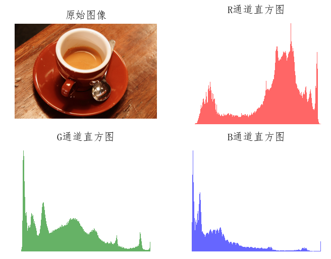
- 一般颜色直方图对图像的旋转、小幅平移、小幅缩放等变换不敏感，对图像质量的变化（如增加噪声也不敏感），所以一般颜色直方图法适用于对难以进行语义分割的图像和无需考虑空间位置的图像进行描述。
- 计算机的固有量化机制导致一般颜色直方图法会忽略颜色间的相似性。

#### 全局累加直方图

- 当图像中的颜色值不能取遍所有可能的颜色值时，一般颜色直方图中就会出现一些零值。这些零值的出现会影响相似性的度量，进而使计算出的相似度不能准确反映图像之间的颜色分布差异。
- 为了弥补一般颜色直方图的缺陷，再一般颜色直方图的基础上，通过对直方图颜色进行累加，消除零值影响，形成全局累加直方图。

#### 主色调直方图

- 在一幅图像中，不同颜色值出现的概率不尽相同，且通常情况下少数几种颜色就能涵盖整幅图像的主色调。
- 基于该思想，主色调直方图会计算出图像中每种颜色出现的频率，选择出现频率最高的几种颜色并将其作为主色调。使用主色调直方图，不会降低颜色直方图匹配的效果，反而会抑制图像非主要成分的噪声，降低噪声对图像匹配的影响。

**颜色直方图的优点和缺点如下。**

- 优点：计算简单，对图像的平移和旋转变换不敏感，能简单描述图像中颜色的全局分布情况。
- 缺点：无法捕捉（即丢失）颜色组成之间的空间位置关系。

### 1.2 颜色矩

- 矩是非常重要的统计量，用于表征数据分布的特点。在统计中，一阶矩表示数据的均值，二阶矩表示数据分布的方差，三阶矩表示数据分布的偏移度。
- 图像的颜色矩用于对图像内颜色分布进行表征，是重要的一种全局图像特征表示。数字图像中颜色分布的统计信息主要集中在低阶矩中。
- 图像的颜色矩特征提取时主要瞄准图像颜色矩中的一阶矩、二阶矩、三阶矩，对图像而言，这三种统计特征已经足以表达数字图像的颜色分布。
- 相对于颜色直方图特征提取，颜色矩特征提取的优点是无须对颜色特征进提前量化。
- 一阶矩可以表征该颜色通道的平均响应强度，二阶矩可以表示该颜色通道的响应方差，三阶矩可以表征该颜色通道数据分布的偏移度。针对彩色图像，图像的颜色矩一共有 9 个分量，每个颜色通道均有 3 个低阶矩。
- 颜色矩仅使用少数几个矩容易导致过多错误检出，因而其通常和其他的几个特征配合使用。

```python
from matplotlib import pyplot as plt
from skimage import data, exposure
import numpy as np
from scipy import stats

# 中文显示工具函数
def set_ch():
    from pylab import mpl
    mpl.rcParams['font.sans-serif'] = ['FangSong']
    mpl.rcParams['axes.unicode_minus'] = False

set_ch()

image = data.coffee()
# 求RGB图像的颜色矩特征，共9维特征
# 定义3*3数组，分别对RGB图像的三个通道求均值、方差、偏移量
features = np.zeros(shape=(3, 3))
for k in range(image.shape[2]):
    mu = np.mean(image[:, :, k])  # 求均值
    delta = np.std(image[:, :, k])  # 求方差
    skew = np.mean(stats.skew(image[:, :, k]))  # 求偏移量
    features[0, k] = mu
    features[1, k] = delta
    features[2, k] = skew
print(features)


```

### 1.3 颜色集

- 颜色集又可以称为颜色索引集，是对颜色直方图的一种近似。
- 颜色集方法的步骤是：第一，将图像从 RGB 图像空间转换到 HSV 颜色空间等视觉均衡的颜色空间，并将颜色空间量化为若干个边长均等的小立方体。第二，使用基于颜色的自动分割技术，将图像划分为若干个子区域。第三，使用颜色量化空间中的某个颜色分类索引每个子区域，以将图像表示为一个二进制的颜色索引集。
  ① 像素矢量表示
  ② 颜色空间转换
  ③ 颜色集索引
  ④ 颜色集表示

### 1.4 颜色聚合向量

- 颜色聚合向量是在颜色直方图上做进一步运算，其核心思想就是将属于颜色直方图的每个颜色量化区间的像素分为两部分，如果该颜色量化区间中的某些像素，占据连续区域的面积大于指定阈值，则将该区域内的像素作为聚合像素，否则作为非聚合像素。
- 颜色聚合向量除了包含颜色频率信息外，也包含颜色的部分空间分布信息，因此其可以获得比颜色直方图过更好的效果。颜色聚合向量算法的具体步骤如下。
  **① 量化**
  颜色聚合向量算法的第一步与求普通的颜色直方图类似，即对图像进行量化处理。一般采用均匀量化方法，量化的目标是使图像中只保留有限个颜色空间。
  **② 连通区域划分**
  针对重新量化后的像素矩阵，根据像素间的连通性把图像划分为若干个连通区域。
  **③ 判断聚合性**
  统计每个连通区域中的像素数目，根据设定的阈值判断该区域中的像素的聚合性
  **④ 聚合向量形成**

### 1.5 颜色相关图

- 颜色相关图不仅可以显示像素在图像中的占比，也可以反映不同颜色对间的空间位置的相关性。
- 颜色相关图利用颜色对间的相对距离分布来描述空间位置信息。

```python
from matplotlib import pyplot as plt
from skimage import data, exposure
import numpy as np
from scipy import stats

# 中文显示工具函数
def set_ch():
    from pylab import mpl
    mpl.rcParams['font.sans-serif'] = ['FangSong']
    mpl.rcParams['axes.unicode_minus'] = False

set_ch()

def isValid(X, Y, point):
    """
    判断某个像素是否超出图像空间范围
    :param X:
    :param Y:
    :param point:
    :return:
    """
    if point[0] < 0 or point[0] >= X:
        return False
    if point[1] < 0 or point[1] >= Y:
        return False
    return True

def getNeighbors(X, Y, x, y, dist):
    """
    Find pixel neighbors according to various distances
    :param X:
    :param Y:
    :param x:
    :param y:
    :param dist:
    :return:
    """
    cn1 = (x + dist, y + dist)
    cn2 = (x + dist, y)
    cn3 = (x + dist, y - dist)
    cn4 = (x, y - dist)
    cn5 = (x - dist, y - dist)
    cn6 = (x - dist, y)
    cn7 = (x - dist, y + dist)
    cn8 = (x, y + dist)
    points = (cn1, cn2, cn3, cn4, cn5, cn6, cn7, cn8)
    Cn = []
    for i in points:
        if (isValid(X, Y, i)):
            Cn.append(i)
    return Cn

def corrlogram(image, dist):
    XX, YY, tt = image.shape
    cgram = np.zeros((256, 256), dtype=np.int)
    for x in range(XX):
        for y in range(YY):
            for t in range(tt):
                color_i = image[x, y, t]
                neighbors_i = getNeighbors(XX, YY, x, y, dist)
                for j in neighbors_i:
                    j0 = j[0]
                    j1 = j[1]
                    color_j = image[j0, j1, t]
                    cgram[color_i, color_j] = cgram[color_i, color_j] + 1
    return cgram


img = data.coffee()
dist = 4
cgram = corrlogram(img, dist)
plt.imshow(cgram)
plt.show()


```

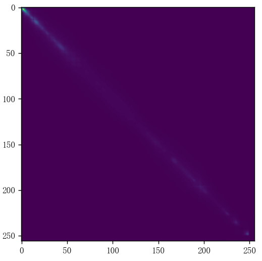

## 2 图像纹理特征提取

- 纹理是一种反映图像中同质现象的视觉特征，它体现了物体表面的具有重复性或周期性变化的表面结构组织排列属性。纹理有三大特点：重复性、周期性、同质性。**① 重复性**图像可以看作是某种局部元素在全局区域的不断重复出现。**② 周期性**图像中元素并非随机出现，而是按照一定的周期性重复出现。**③ 同质性**重复出现的元素在结构和尺寸上大致相同。
- 纹理是某种局部序列不断重复、非随机排列、在结构和尺寸上大致相同的统一体。
  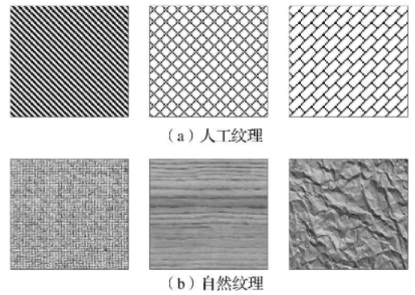
- 不同于灰度、颜色等图像特征，纹理特征通过像素及其周边空间域像素的灰度分布进行描述，也就是局部纹理信息。局部纹理的反复排布呈现出的重复性，就是所谓的全局纹理信息。
- 纹理信息在表现全局特征性质的同时，也体现了图像或图像所在区域对应景物的表面特性。纹理特征只是对物体表面特性进行描述，并不能反映物体的本质属性，即图像高层语义信息。
- 纹理特征提取过程是通过一定的图像处理技术抽取出纹理特征，从而获得纹理的定量或定性描述的过程。纹理特征提取的基本过程如下。**① 纹理基元建模**从像素出发，找出纹理基元（即纹理图像中辨识能力比较强的特征），并根据纹理基元的排列信息，建立起纹理基元模型。**② 整体纹理模型构建**利用纹理基元模型对纹理图像进行特征提取，以支持对图像的进一步分割、分类以及辨识，形成图像整体纹理模型。
- 常见的纹理特征提取方法可以分为如下 4 类。
  **① 统计分析法**
  统计分析法又称基于统计纹理特征的检测方法，该方法假设纹理图像在空间灰度分布上，存在某种重复性，通过对纹理图像的灰度空间分布进行计算，从而得到纹理特征，主要包括灰度直方图法、灰度共生矩阵法、灰度行程长度法、灰度差分统计、交叉对角矩阵、自相关函数法等。该类方法在木纹、沙地、草地之类的图像分析上很有效。其主要优势是：方法简单，易于实现，典型的代表方法是灰度共生矩阵法，被认为是比较有效的纹理分析方法。
  **② 结构分析法**
  结构分析法认为纹理基元之间存在某种结构规则关系，该类方法首先对图像中的纹理基元进行分离，然后基于纹理基元的特征和空间排列规则对纹理进行表征，主要包括偏心度、面积、方向等特征，其主要目标是通过图像结构特征和排列规则的描述，得到纹理特征的描述，此类算法主要适用于已知纹理基元的情况，对砖墙、纤维等纹理基元和排列规则都比较明显的图像有效。
  **③ 模型分析法**
  模型分析法基于像素及其邻域像素之间的关系建立模型，根据不同模型提取不同特征量，进行参数估计。典型的模型分析法包括自然回归法、马尔可夫条件随机场法以及分形法等。
  **④ 频谱分析法**
  频谱分析法又称为信号处理法和滤波方法。该方法将纹理图像从空间域变换到频域，然后通过计算峰值处的面积、峰值与原点的距离平方、峰值处的相位、两个峰值间的相角差等，获得在空间域不易获得的纹理特征，如周期、功率谱信息等，典型的频谱分析法有二维傅里叶（变换）滤波方法，Gabor（变换）滤波变换和小波方法等。

### 2.1 统计纹理分析方法

- 统计纹理分析方法是较常用的纹理特征描述分析方法，通过统计图像的空间频率、边界频率以及空间灰度依赖关系等对纹理进行描述。
- 细致的纹理有较高的频率，例如，布匹的纹理是非常细致的纹理，其纹理基元较小，出现频率较高。粗糙的纹理结构具有较低的空间频率，如大理石纹理一般较粗糙，具有较大的纹理基元，出现频率较低。
- 纹理图像的空间频率可以作为纹理描述的一种方式。边界频率是另外一种基于统计的纹理图像描述方法，边界频率越高，表明纹理越精细。空间灰度依赖关系方法通过描述纹理结构之间的空间依赖关系描述纹理。
- 常用的统计纹理分析方法有自相关函数、边界频率、灰度共生矩阵等。统计纹理分析方法并不刻意精确描述纹理的结构。从统计学的角度看，纹理图像是一些复杂的模式，通常通过获得的统计特征集描述这些模式。
- 灰度共生矩阵法也称联合概率矩阵法。该方法基于图像中的灰度结构重复出现的概率，对图像纹理特征进行描述。该方法的本质是使用条件概率表征纹理特征，通过对空间上，具有某种位置关系的一对像素成对出现的概率进行统计，得到灰度共生矩阵，然后从灰度共生矩阵中提取有意义的统计特征对纹理进行描述。

```python
from matplotlib import pyplot as plt
from skimage.feature import greycomatrix, greycoprops
from skimage import data
import numpy as np

# 中文显示工具函数
def set_ch():
    from pylab import mpl
    mpl.rcParams['font.sans-serif'] = ['FangSong']
    mpl.rcParams['axes.unicode_minus'] = False

set_ch()
PATCH_SIZE = 21
image = data.camera()
# 选择图像中的草地区域
grass_locations = [(474, 291), (440, 433), (466, 18), (462, 236)]
grass_patches = []
for loc in grass_locations:
    grass_patches.append(image[loc[0]:loc[0] + PATCH_SIZE, loc[1]:loc[1] + PATCH_SIZE])

# 选择图像中的天空区域
sky_locations = [(54, 48), (21, 233), (90, 380), (195, 330)]
sky_patches = []
for loc in sky_locations:
    sky_patches.append(image[loc[0]:loc[0] + PATCH_SIZE, loc[1]:loc[1] + PATCH_SIZE])
# 计算每个块中灰度共生矩阵属性
xs = []
ys = []
for patch in (grass_patches + sky_patches):
    glcm = greycomatrix(patch, [5], [0], 256, symmetric=True, normed=True)
    xs.append(greycoprops(glcm, 'dissimilarity')[0, 0])
    ys.append(greycoprops(glcm, 'correlation')[0, 0])
# 创建绘图
fig = plt.figure(figsize=(8, 8))
# 展现原始图像，以及图像块的位置
ax = fig.add_subplot(3, 2, 1)
ax.imshow(image, cmap=plt.cm.gray, interpolation='nearest', vmin=0, vmax=255)
for (y, x) in grass_locations:
    ax.plot(x + PATCH_SIZE / 2, y + PATCH_SIZE / 2, 'gs')
for (y, x) in sky_locations:
    ax.plot(x + PATCH_SIZE / 2, y + PATCH_SIZE, 'bs')
ax.set_xlabel('原始图像')
ax.set_xticks([])
ax.set_yticks([])
ax.axis('image')
# 对于每个块，plot(dissimilarity,correlation)
ax = fig.add_subplot(3, 2, 2)
ax.plot(xs[:len(grass_patches)], ys[:len(grass_patches)], 'go', label='Grass')
ax.plot(xs[:len(sky_patches)], ys[:len(sky_patches)], 'bo', label='Sky')
ax.set_xlabel('灰度共生矩阵相似性')
ax.set_ylabel('灰度共生矩阵相关度')
ax.legend()
# 展示图像
for i, patch in enumerate(grass_patches):
    ax = fig.add_subplot(3, len(grass_patches), len(grass_patches) * 1 + i + 1)
    ax.imshow(patch, cmap=plt.cm.gray, interpolation='nearest', vmin=0, vmax=255)
    ax.set_xlabel('Grass %d' % (i + 1))
for i, patch in enumerate(sky_patches):
    ax = fig.add_subplot(3, len(sky_patches), len(sky_patches) * 2 + i + 1)
    ax.imshow(patch, cmap=plt.cm.gray, interpolation='nearest', vmin=0, vmax=255)
    ax.set_xlabel('Sky %d' % (i + 1))
# 展示图像块并显示
fig.suptitle('Grey level co-occurrence matrix features', fontsize=14)
plt.show()


```

- 基于灰度共生矩阵的纹理描述方法
  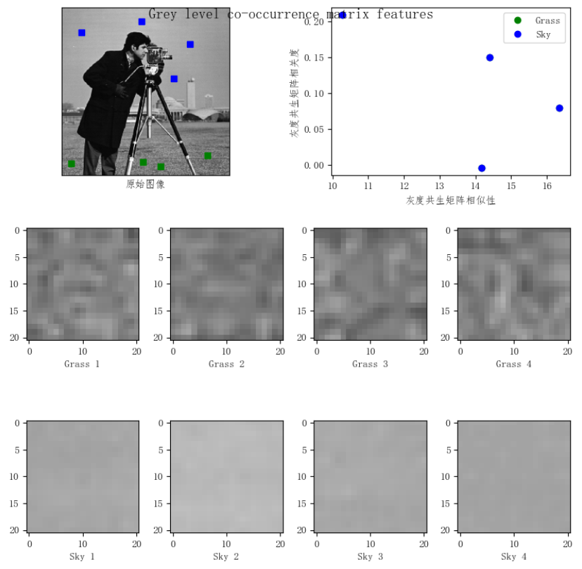

### 2.2 Laws 纹理能量测量法

- Laws 纹理能量测量法是一种典型的一阶纹理分析方法，在纹理分析领域有一定影响。
- Laws 纹理能力测量的基本思想是创建两个窗口：一个是微窗口，可为 3×3、5×5 或 7×7，常取 5×5 测量以像元为中心的小区域的灰度的不规则性，以形成属性，称为微窗口滤波；另一个是宏窗口，为 15×15 或 32×32，用来在更大的区域上求属性的一阶统计量（常为均值和标准偏差），称为能量变换。
- 整个纹理分析过程为：`f(x,y)`→ 微窗口滤波 →`F(x,y)`→ 能量转换 →`E(x,y)`→ 分类

### 2.3 Gabor 变换

- 大量心理和生理学研究发现，在人类的低级视觉中，输入信号被一系列具有不同频率和方位的线性空间滤波器分解成一组频率和方位通道，Gabor 分解可以很好的描述这一信号分解过程。
- Gabor 变换具有两个重要的特性。一是其良好的空间域与频域局部化性质。二是无论从空间域的起伏特性上，方位选择特性上，空间域与频域选择上，还是从正交相位的关系上，二维 Gabor 基函数具有与大多数哺乳动物的视觉表皮简单细胞的二维感知域模型相似的性质。
- 可以借鉴人类处理信号的特性，用包含多个 Gabor 滤波器的滤波器组，对图像进行不同中心频率和方位的滤波处理，从而提取不同频率成分和不同方位的特征，作为目标的非参数化特征，研究其不同分辨率目标的特征与图像分辨率的关系。
- Gabor 滤波器滤波过程
  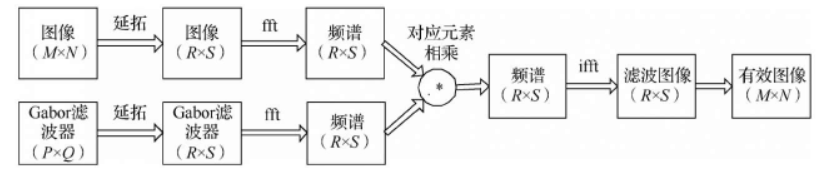

### 2.4 局部二值模式

- 局部二值模式（Local Binary Pattern，LBP）的基本思想是将中心像素点的灰度值作为阈值，将其邻域内的像素点灰度值与阈值进行比较，从而得到二进制编码用以表述局部纹理特征。
- LBP 表示方法不易受图像整体灰度线性变化的影响，当图像的灰度值发生线性均匀变化时，其 LBP 特征编码是不变的。
- LBP 特征计算简单，表征能力强，在纹理特征描述上具有较好的效果。
- 基本 LBP 算子：3/\*3 的矩形块，有一个中心像素和 8 个邻域像素，分别对应 9 个灰度值。
- 特征值：以中心像素的灰度值为阈值，将其邻域的 8 个灰度值与阈值比较，大于中心灰度值的像素用 1 表示，反之用 0 表示。然后顺时针方向读出 8 个二进制值。
  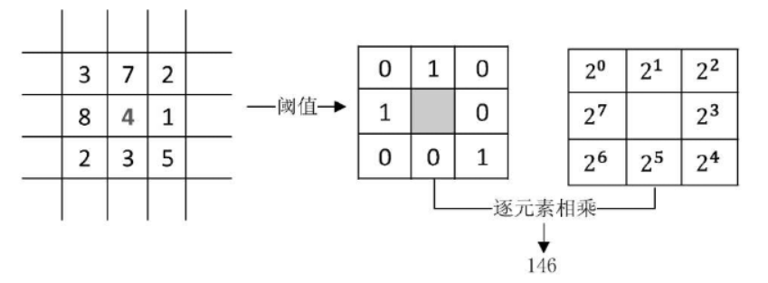
- 经阈值化后的二值矩阵，可以看出一个二值纹理模式，用来刻画邻域内，像素点的灰度相对中心点的变化。
- 因为人类视觉系统对纹理的感知与平均灰度（亮度无关），而局部二值模式方法注重像素灰度的变化，符合人类视觉对纹理感知的特点。

```python
import skimage.feature
import skimage.segmentation
import skimage.data
import matplotlib.pyplot as plt

# 中文显示工具函数
def set_ch():
    from pylab import mpl
    mpl.rcParams['font.sans-serif'] = ['FangSong']
    mpl.rcParams['axes.unicode_minus'] = False

set_ch()
img = skimage.data.coffee()
for colour_channel in (0, 1, 2):
    img[:, :, colour_channel] = skimage.feature.local_binary_pattern(img[:, :, colour_channel], 8, 1.0, method='var')
plt.imshow(img)
plt.show()


```

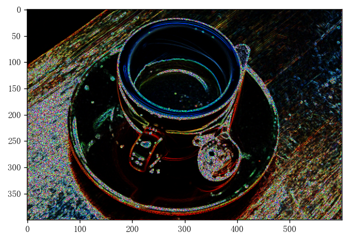

## 3 图像形状特征提取

- 形状和区域特征是图像中的另一类重要特征。不同于颜色、纹理等底层特征，对形状特征的描述必须以对图像中的物体或区域对象的分割为前提。
- 形状特征的表示方法可以分为两类：一是基于轮廓特征，典型方法是傅里叶描述符方法。二是基于区域特征，典型方法是形状无关矩法。轮廓特征中只用到物体的边界，而区域特征需要考虑整个形状区域。

### 3.1 简单形状特征

- 矩形度。反应物体对外接矩形的充满度，用物体的面积与其最小外接矩形的面积之比描述。
  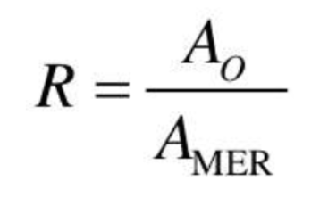
- 球状性。球状性既可以描述二维目标，也可描述三维目标。
  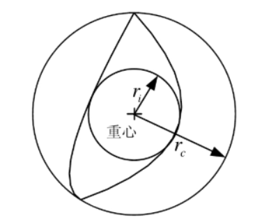
- 圆形性。目标圆形性是指用目标区域 R 的所有边界点定义的特征量。

### 3.2 傅里叶描述符

- 傅里叶描述符是用于单封闭曲线形状特征描述的常用工具。傅里叶描述符将待描述目标曲线看组一维数值序列，使用傅里叶变换对该序列进行转换，得到描述该曲线的一系列傅里叶系数。
- 傅里叶描述符具有计算简单、描述清晰等优点。相较于其他复杂的描述方法，傅里叶描述符更加直观，易于理解。
- 傅里叶描述方法一般分为两步：首先，定义轮廓线的表示，把坐标的序列点看作复数，即 `s(k)`\=`x(k)`+`jy(k)`，x 轴作为实轴，y 轴作为虚轴，边界的性质不变。这种表示方法的优点是将一个二维边缘描述问题，简化为一个一维序列描述问题。其次，对一维序列 s(k)进行傅里叶变换，并求得其傅里叶系数。

### 3.3 形状无关矩

- 由于图像区域的某些矩对于平移、旋转、尺度等几何变换具有一些不变的特性，使得矩的表示方法在物体的分类与识别方面具有重要的意义。

## 4 图像边缘特征提取

- 图像边缘具有方向和幅度两个主要成分。沿边缘方向移动，像素的灰度值变化速率较为平缓，而沿垂直于边缘的方向移动，像素的灰度值变化率较为剧烈。这种剧烈的变化或者呈阶跃状（Step Edge），或呈屋顶状（Proof Edge），分为称为阶跃状边缘和屋顶状边缘。根据边缘的性质，一般用一阶或二阶导数对其进行描述和检测。
  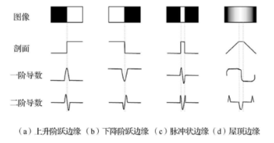
- 图像中的边缘可以通过对他们求导数确定，而导数可利用微分算子计算。对于数字图像处理而言，通常利用差分近似微分。
- 图像边缘检测的基本步骤如下。**① 滤波**边缘检测主要基于导数计算，但易受噪声影响，滤波操作的主要目的是降低噪声的干扰，但滤波在降低噪声的同时，也会损失边缘强度。**② 增强**增强算法将局部邻域中灰度值有显著变化的点突出显示，一般可通过计算梯度幅值完成。**③ 检测**有些图像中梯度幅值较大的点并不是边缘点，需要对其进行进一步筛选，最简单的检测方法是设定梯度幅值阈值。**④ 定位**定位即精确确定边缘的位置。
- 传统边缘检测的流程。

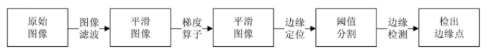

### 4.1 梯度边缘检测

- 梯度的方向（由梯度矢量的幅角表示）是函数 f(x,y)增加最快的方向，定义为 `ϕ(x,y)`\=`arctan(Gy/Gx)`，从梯度原理出发，已经发展了很多边缘检测算子。

### 4.2 一阶边缘检测算子

#### 罗伯特算子

- 罗伯特边缘检测算子，用对角线上相邻像素之差代替梯度寻找边缘。
- 罗伯特边缘检测的步骤：
  （1）用两个模板分别对图像进行运算得到 `Rxf`和 `Ryf`，并计算 `|G(i,j)|`\=`|Gx|`+`|Gy|`；
  （2）判断该相加结果是否大于某个阈值。如果满足条件，则将其作为结果图像中对应模板(i,j)位置的像素值；如果不满足条件，则结合结果图像中对应模板 `(i,j)`位置的像素赋 0 值。

```python
import matplotlib.pyplot as plt
from skimage.data import camera
from skimage.filters import roberts

# 中文显示工具函数
def set_ch():
    from pylab import mpl
    mpl.rcParams['font.sans-serif'] = ['FangSong']
    mpl.rcParams['axes.unicode_minus'] = False

set_ch()
image = camera()
edge_roberts = roberts(image),
fig, ax = plt.subplots(ncols=2, sharex=True, sharey=True, figsize=(8, 4))
ax[0].imshow(image, cmap='gray')
ax[0].set_title('原始图像')

ax[1].imshow(edge_roberts, cmap='gray')
ax[1].set_title('Roberts 边缘检测')
for a in ax:
    a.axis('off')
plt.tight_layout()
plt.show()


```

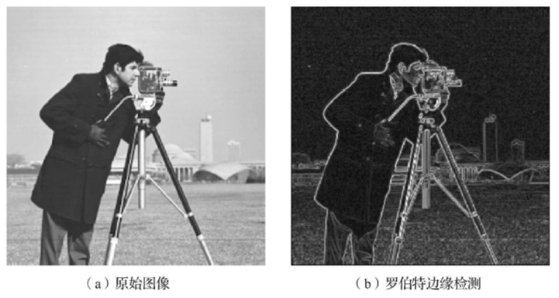

#### 索贝尔算子

- 索贝尔边缘检测的步骤：
  （1）用两个模板分别对图像进行计算，得出 `|G(i,j)|`\=`Gx`+`Gy`；
  （2）判别该相加结果是否大于或等于某个阈值，如果满足条件，则将其作为结果图像中对应模板 `(i,j)`位置的像素值；如果不满足条件，则给结果图像中对应模板 `(i,j)`位置的像素赋 0 值。

```python
import matplotlib.pyplot as plt
from skimage.data import camera
from skimage.filters import sobel, sobel_v, sobel_h

# 中文显示工具函数
def set_ch():
    from pylab import mpl
    mpl.rcParams['font.sans-serif'] = ['FangSong']
    mpl.rcParams['axes.unicode_minus'] = False

set_ch()
image = camera()
edge_sobel = sobel(image)
edge_sobel_v = sobel_v(image)
edge_sobel_h = sobel_h(image)
fig, ax = plt.subplots(ncols=2, nrows=2, sharex=True, sharey=True, figsize=(8, 4))

ax[0, 0].imshow(image, cmap=plt.cm.gray)
ax[0, 0].set_title('原始图像')

ax[0, 1].imshow(edge_sobel, cmap=plt.cm.gray)
ax[0, 1].set_title('Sobel 边缘检测')

ax[1, 0].imshow(edge_sobel_v, cmap=plt.cm.gray)
ax[1, 0].set_title('Sobel 垂直边缘检测')

ax[1, 1].imshow(edge_sobel_h, cmap=plt.cm.gray)
ax[1, 1].set_title('Sobel 水平边缘检测')

for a in ax:
    for j in a:
        j.axis('off')
plt.tight_layout()
plt.show()


```

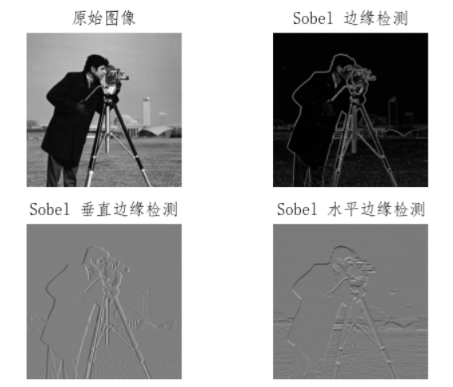

- 索贝尔边缘检测算子在较好的获得边缘性效果的同时，对噪声具有一定的平滑作用，减少了噪声的敏感性。但索贝尔边缘检测的边缘比较粗，会检测出一些伪边缘，边缘检测精度较低。

#### Prewitt 算子

- Prewitt 算子在方向和方向的梯度幅值上的形式，与索贝尔算子的形式完全相同，只是系数均为 1，对应的 3\*3 模板为
  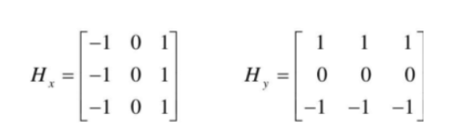
- Prewitt 算子的计算比索贝尔算子更简单，但在噪声抑制方面，索贝尔算子比 Prewitt 算子略胜一筹。
- 梯度算子对噪声有一定的敏感性，所以适用于图像边缘灰度值比较尖锐，且图像中噪声比较小的情况

### 4.3 二阶边缘检测算子

- 在利用一阶导数的边缘检测算子进行边缘检测时，有时会出现因检测到的边缘点过多，而导致边缘线过粗的情况。
- 通过去除一阶导数中的非局部最大值，就可以检测出更细的边缘，而一阶导数的局部最大值对应二阶导数的零交叉点。所以，通过找图像的二阶导数的零交叉点，就能找到精确的边缘点。

#### 拉普拉斯（Laplace）算子

- 对阶跃状边缘，其二阶导数在边缘点出现过零交叉，即边缘点两旁的二阶导数取异号，据此可通过二阶导数检测边缘点。
- Laplace 算子的边缘检测

```python
import matplotlib.pyplot as plt
from skimage.data import camera, coffee
from skimage.filters import laplace

# 中文显示工具函数
def set_ch():
    from pylab import mpl
    mpl.rcParams['font.sans-serif'] = ['FangSong']
    mpl.rcParams['axes.unicode_minus'] = False

set_ch()
image_camera = camera()
edge_laplace_camera = laplace(image_camera)
image_coffee = coffee()
edge_laplace_coffee = laplace(image_coffee)
fig, ax = plt.subplots(ncols=2, nrows=2, sharex=True, sharey=True, figsize=(8, 6))

ax[0, 0].imshow(image_camera, cmap=plt.cm.gray)
ax[0, 0].set_title('原始图像')

ax[0, 1].imshow(edge_laplace_camera, cmap=plt.cm.gray)
ax[0, 1].set_title('Laplace 边缘检测')

ax[1, 0].imshow(image_coffee, cmap=plt.cm.gray)
ax[1, 0].set_title('原始图像')

ax[1, 1].imshow(edge_laplace_coffee, cmap=plt.cm.gray)
ax[1, 1].set_title('Laplace 边缘检测')

for a in ax:
    for j in a:
        j.axis('off')
plt.tight_layout()
plt.show()


```

- 边缘检测算子模板的基本特征是中心位置的系数为正，其余位置的系数为负，且模板的系数之和为 0.
- 它的使用方法是用图中的两个点阵之一作为卷积核，与原图像进行卷积运算即可。
- Lapace 检测模板的特点是各向同性，对孤立点及线端的检测效果好，Laplace 算子的缺点是会出现边缘方向信息丢失，对噪声敏感，整体检测效果不如梯度算子，且与索贝尔算子相比，对图像进行处理时，Laplace 算子能使噪声成分得到加强，对噪声更敏感。
  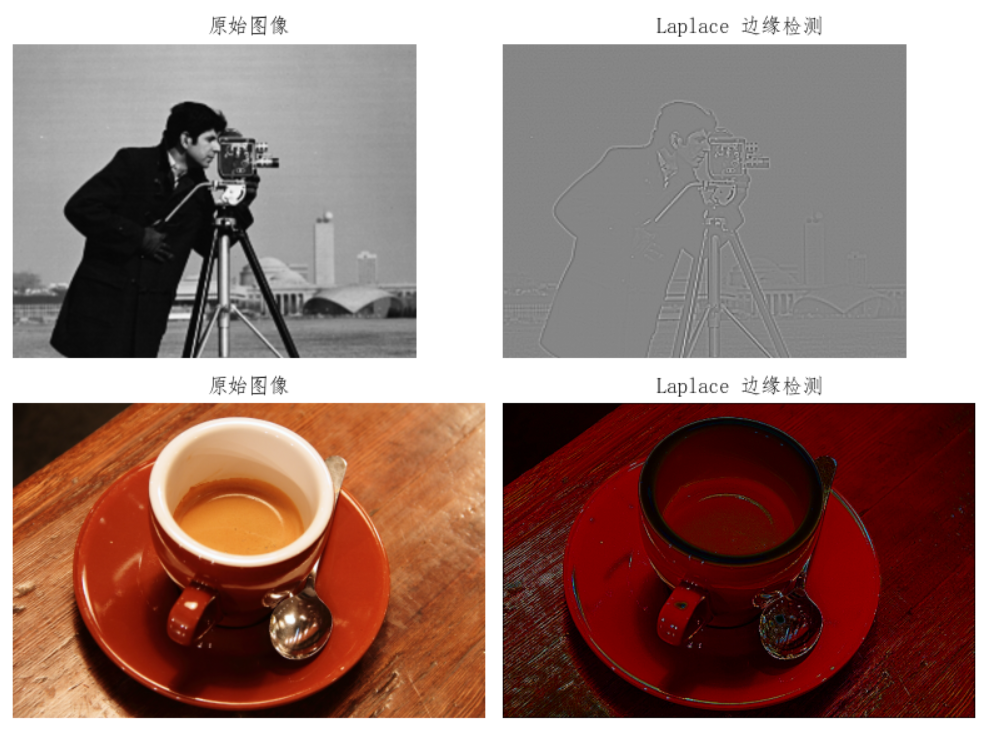

#### LoG 边缘检测算子

- 实际应用中，由于噪声的影响，对噪声敏感的边缘检测点检测算法（如拉普拉斯算子法）可能会把噪声当边缘检测点检测出来，而真正的边缘点会被噪声淹没而未检测出。
- LoG 算子基于 Laplace 算子和 Gauss 算子，也称拉普拉斯-高斯边缘检测算子。
- 由于平滑会导致边缘的延展，因此在边缘检测时，仅考虑那些具有局部最大值的点为边缘点。

```python
import matplotlib.pyplot as plt
from skimage.data import camera, coffee
from skimage.filters import laplace, gaussian

# 中文显示工具函数
def set_ch():
    from pylab import mpl
    mpl.rcParams['font.sans-serif'] = ['FangSong']
    mpl.rcParams['axes.unicode_minus'] = False

set_ch()
image = camera()
edge_laplace = laplace(image)
gaussian_image = gaussian(image)
edge_LoG = laplace(gaussian_image)

fig, ax = plt.subplots(ncols=2, nrows=2, sharex=True, sharey=True, figsize=(8, 6))

ax[0, 0].imshow(image, cmap=plt.cm.gray)
ax[0, 0].set_title('原始图像')

ax[0, 1].imshow(edge_laplace, cmap=plt.cm.gray)
ax[0, 1].set_title('Laplace 边缘检测')

ax[1, 0].imshow(gaussian_image, cmap=plt.cm.gray)
ax[1, 0].set_title('高斯平滑后的图像')

ax[1, 1].imshow(edge_LoG, cmap=plt.cm.gray)
ax[1, 1].set_title('LoG 边缘检测')

for a in ax:
    for j in a:
        j.axis('off')
plt.tight_layout()
plt.show()


```

- 基于 LoG 的边缘检测效果
  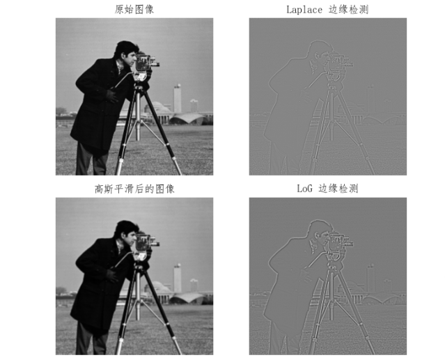

## 5 图像点特征提取

- 如果图像中一个非常小的区域的灰度值，与其邻域值相比有明显的差异，则称这个非常小的区域为图像点（一般意义上的孤立像素点）
  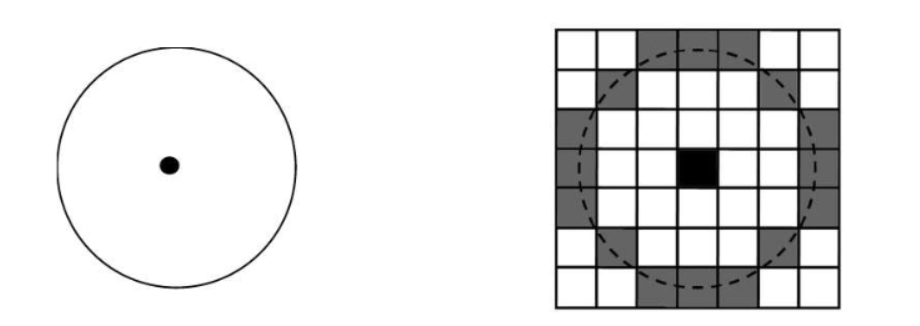
- 目前对图像点特征提取的技术有多种，其中研究最多、应用最广的是角点检测算法。
- 从直观可视的角度出发，两条直线相交的顶点可看作是角点；物体的几个平面的相交处也可以看作角点。从图像特征的角度出发，图像中周围灰度变化较剧烈的点可看作是角点；图像边界上曲率足够高的点也可以看作是角点。
- 常见的角点类型。
  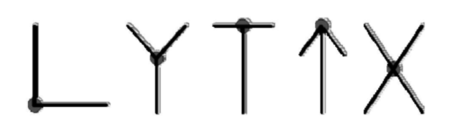
- 角点的检测方法有很多种，其检测原理也多种多样，但这些方法概括起来大体可分为 3 类：一是基于模板的角点检测算法；二是基于边缘的角点检测算法；三是基于图像灰度变化的角点检测算法。其中，基于图像灰度变化的角点检测算法应用最广泛。
- SUSAN 角点检测算法选用圆形模板，将位于圆形窗口模板中心等待检测的像素点称为核心点。核心点的邻域被划分为两个区域：亮度值相似于核心点亮度的区域即核值相似区和亮度值不相似于核心点亮度的区域。
- SUSAN 算法通过核值相似区的大小判别图像角点，并实现图像中角点特征的检测和提取。
  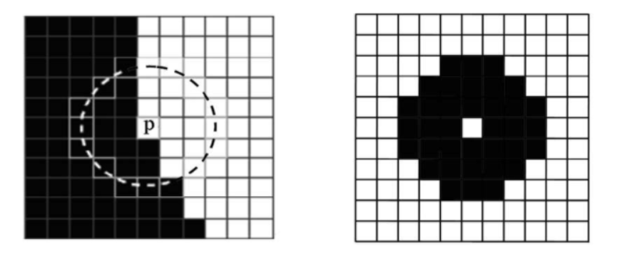
- SUSAN 算子实现代码

```python
import matplotlib.pyplot as plt
from skimage.data import camera
import numpy as np

# 中文显示工具函数
def set_ch():
    from pylab import mpl
    mpl.rcParams['font.sans-serif'] = ['FangSong']
    mpl.rcParams['axes.unicode_minus'] = False

def susan_mask():
    mask = np.ones((7, 7))
    mask[0, 0] = 0
    mask[0, 1] = 0
    mask[0, 5] = 0
    mask[0, 6] = 0
    mask[1, 0] = 0
    mask[1, 6] = 0
    mask[5, 0] = 0
    mask[5, 6] = 0
    mask[6, 0] = 0
    mask[6, 1] = 0
    mask[6, 5] = 0
    mask[6, 6] = 0
    return mask

def susan_corner_detection(img):
    img = img.astype(np.float64)
    g = 37 / 2
    circularMask = susan_mask()
    output = np.zeros(img.shape)
    for i in range(3, img.shape[0] - 3):
        for j in range(3, img.shape[1] - 3):
            ir = np.array(img[i - 3:i + 4, j - 3:j + 4])
            ir = ir[circularMask == 1]
            ir0 = img[i, j]
            a = np.sum(np.exp(-((ir - ir0) / 10) ** 6))
            if a <= g:
                a = g - a
            else:
                a = 0
            output[i, j] = a
    return output


set_ch()
image = camera()
out = susan_corner_detection(image)
plt.imshow(out, cmap='gray')
plt.show()


```

- 基于 SUSAN 算子的角点检测响应图像
  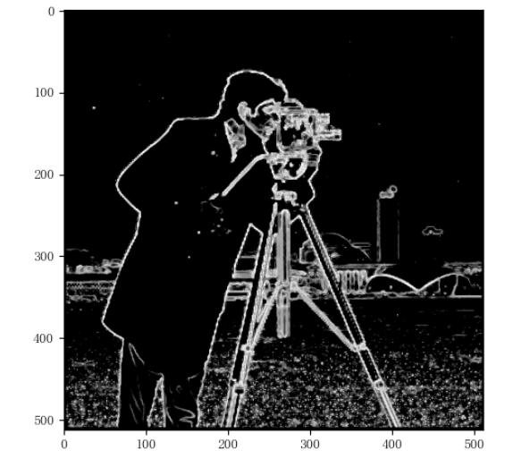
