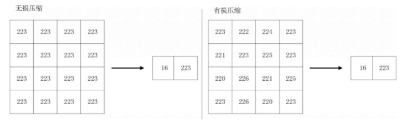
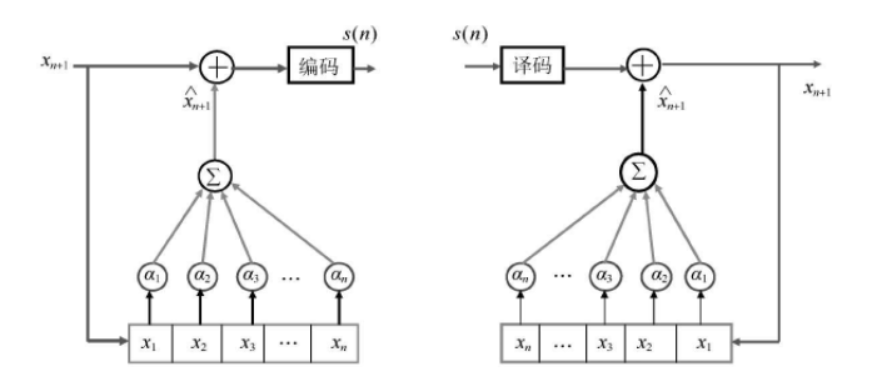
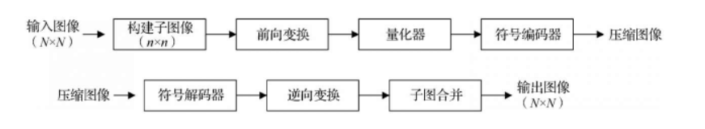
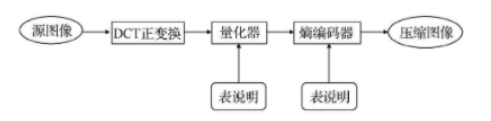

# 图像压缩

<!-- more -->

- 数字化之后的图像数据占用的空间非常大，如一幅分辨率为 `800 * 600`像素的 32 位灰度图像，其像素数目位 `480000`，占用空间大小为 `480000` \* `32bit` = `480000` \* `4B` = 1.83 \* 1024 \* 1024 B，即 1.83MB。目前电影的帧率一般为 24 帧每秒，此分辨率下存储一秒的电影需要 `1.83` \* `24` = `43.92MB`。
- 图像数据给图像存储及图像传输造成了很大的困难。图像压缩是将图像数据存在的冗余信息去掉，以实现有效压缩。

## 1 图像压缩简介

- 数据是用来表示信息的，如果不同的方法为表示给定量的信息，使用了不同的信息，那么使用较多数据量的方法中，有些信息必然代表了无用信息。冗余数据的存在为图像压缩提供了可能。

（1）编码冗余
如果一个图像的灰度级编码使用了多于实际需要的编码符号，就称该图像包含了编码冗余。如可以使用 8 位表示图像的像素，也可以使用 1 位表示该图像的像素，就称该图像存在编码冗余。

（2）像素间冗余
像素间冗余反应了图像中像素之间的相互关系。图像像素值并非完全随机，而是与其相邻像素存在某种关联关系。对于一幅图像，很多单个像素对视觉的贡献是冗余的。它的值可以通过与它相邻的像素值进行预测。因为任何给定像素的值可以根据与这个像素相邻的像素进行预测，所以单个像素携带的信息相对较少。
原图像数据：234 223 231 238 235
压缩后数据：234 -11 8 7 -3

（3）心理视觉冗余眼睛对所有视觉信息感受的灵敏度不同，相比之下，有些信息在通常的视觉过程中并不重要，去除这些信息并不会明显降低图像质量。

- 编码冗余、像素间冗余、心理视觉冗余是一般图像压缩的基础，在此基础上发展出各类编码和压缩算法。按照压缩过程中是否出现信息丢失，可以将图片压缩算法大致分为有损压缩和无损压缩两类，无损图像压缩方法有行程长度编码、熵编码法等。有损图像压缩方法包括变换编码、分形压缩等。
- 无损压缩和有损压缩都是以更少的信息对原图像进行表示，但无损压缩在图像压缩之后可以将信息的原貌进行恢复，而有损压缩进行图像压缩后，会使部分信息丢失，导致无法完全进行原始图像的重建。
  

（1）熵编码或统计编码
熵编码或统计编码属于无损编码，给出现概率较大的符号赋予一个短码子，给出现概率较小的符号赋予一个长码字，从而使最终的平均码长很小。主要的熵编码方法包括哈夫曼编码、香农编码、算术编码。

（2）预测编码
基于图像数据的空间或时间冗余特性，用相邻的已知像素（或像素块）预测当前像素（或像素块）的取值，然后再对预测误差进行量化和编码，包括脉冲编码调制（PCM）、差分脉冲编码调制（DPCM）。

（3）变换编码
将空域上的图像变换到另一个变换域上，变换后图像的大部分能量只集中到少数几个变换系数上，采用适当的量化和熵编码就可以有效压缩图像。

（4）混合编码
混合编码是综合了熵编码、变换编码或预测编码的编码方法，如 JPEG 标准和 MPEG 标准。

## 2 熵编码技术

- 熵编码技术是一类典型无损编码技术。该类编码技术基于信息论对图像进行重新编码，通常的做法是给出现概率较高的符号一个较短的编码，而给出现概率较低的符号一个较长的编码，保证平均编码长度最短，主要编码方法包括哈夫曼编码、香农编码、及算术编码。
- 信息熵是表征某个数据集合或序列所需的最优编码长度的理论值，各种熵编码算法均是从不同角度对此理论值进行近似。

### 2.1 哈夫曼编码

- 哈夫曼编码是不定长编码。哈夫曼编码的基本方法是先对图像数据扫描一遍，计算出各种像素出现的概率，按概率大小指定不同长度的唯一码字，由此得到一张该图像的哈夫曼表。编码后的图像数据记录的是每个像素的码字，而码字与实际像素值对应关系记录在码表中。
- 哈夫曼编码的基本步骤：
  （1）将需要考虑的像素值按概率排序，并将最低概率的像素符号联结为一个单一符号。
  （2）对每个化简后的像素进行编码，从出现概率最小的像素符号开始，一直编码到图像中的所有元素。

```python
import numpy as np
import queue

# 定义需要编码的图像
image = np.array([[3, 1, 2, 4], [2, 4, 0, 2], [2, 2, 3, 3], [2, 4, 4, 2]])
# 计算每种元素出现的概率
hist = np.bincount(image.ravel(), minlength=5)
probabilities = hist / np.sum(hist)

# 找出数据中的最小元素
def get_smallest(data):
    first = second = 1
    fid = sid = 0
    for idx, element in enumerate(data):
        if element < first:
            second = first
            sid = fid
            first = element
            fid = idx
        elif element < second and element != first:
            second = element
    return fid, first, sid, second

# 定义哈夫曼树
class Node:
    def __init__(self):
        """
        元素值存储在叶子结点
        """
        self.prob = None
        self.code = None
        self.data = None
        self.left = None
        self.right = None

    def __lt__(self, other):
        """
        定义优先树中排序规则
        :param other:
        :return:
        """
        if self.prob < other.prob:
            return 1
        else:
            return 0

    def __ge__(self, other):
        if self.prob > other.prob:
            return 1
        else:
            return 0

# 构建哈夫曼树
def tree(probabilities):
    prq = queue.PriorityQueue()
    for color, probability in enumerate(probabilities):
        leaf = Node()
        leaf.data = color
        leaf.prob = probability
        prq.put(leaf)
    while prq.qsize() > 1:
        new_node = Node()
        l = prq.get()
        r = prq.get()
        # 找出叶子结点中概率最小的两个
        # 移除最小的两个结点
        new_node.left = l  # 左侧是较小的
        new_node.right = r
        new_prob = l.prob + r.prob  # 新概率是两个小概率之和
        new_node.prob = new_prob
        prq.put(new_node)  # 插入新结点，替代原有的两个结点
    return prq.get()  # 返回根结点完成树的构建

# 对哈夫曼树进行遍历，得出编码
def huffman_traversal(root_node, tmp_array, f):
    if root_node.left is not None:
        tmp_array[huffman_traversal.count] = 1
        huffman_traversal.count += 1
        huffman_traversal(root_node.left, tmp_array, f)
        huffman_traversal.count -= 1
    if root_node.right is not None:
        tmp_array[huffman_traversal.count] = 0
        huffman_traversal.count += 1
        huffman_traversal(root_node.right, tmp_array, f)
        huffman_traversal.count -= 1
    else:
        huffman_traversal.output_bits[root_node.data] = huffman_traversal.count  # 得出每个元素的编码值
        bit_stream = ''.join(str(cell) for cell in tmp_array[1:huffman_traversal.count])
        color = str(root_node.data)
        wr_str = color + '' + bit_stream + '\n'
        f.write(wr_str)
    return

root_node = tree(probabilities)
tmp_array = np.ones([4], dtype=int)
huffman_traversal.output_bits = np.empty(5, dtype=int)
huffman_traversal.count = 0
f = open('code.txt', 'w')
huffman_traversal(root_node, tmp_array, f)


```

- 哈夫曼编码根据信息论进行数据编码构造，能够达到接近理论最优的效率，但也存在编码过于复杂的问题

### 2.2 算术编码

- 在算术编码中，信源符号和编码之间的一一对应关系并不存在。一个算术编码要赋给整个信源符号序列，而编码本身确定 0 和 1 之间的 1 一个实数区间。随着符号序列中的符号数量增加，用来代表它的区间减小而表达区间的信息单位数量变大。
- 算术编码的具体方法是：将编码的信源消息表示成实数轴 0~1 的一个间隔，消息越长，编码表示的间隔越小，即这一间隔所需的二进制位越多。
- 与哈夫曼编码不同，采用算术编码每个符号的平均编码长度可以为小数。
- 算术编码的思想如下。（1）对一组信源符号，按照符号的概率大小排序，将\[0,1)设为当前分析区间。按信源符号的概率序列，在当前分析区间划分比例间隔。（2）检索“输入消息序列”，锁定当前消息符号（初次检索的话就是第一个消息符号），找到当前符号在当前分析区间的比例间隔，将此间隔作为新的当前分析区间，并把当前分析区间的起点（即左端点）指示的数补加到编码输出数里。当前消息符号指针后移。（3）仍然按照信源符号的概率序列在当前分析区间划分比例间隔。然后重复第二步，直到输入消息序列检索完毕为止。（4）最后的编码输出数就是编码好的数据。
- 在算术编码中需要注意 3 个问题。（1）由于实际计算机的精度不可能无限长，运算中出现溢出是一个明显的问题，但多数计算机都有 16 位、32 位、64 位的精度，因此这个问题可以使用比例缩放方法解决。（2）算术编码器是一种对错误很敏感的方法，如果有一位发生错误，就会导致整个消息翻译错误。
- 算术编码可以是静态的或者自适应的。在静态算术编码中，信源符号的概率是固定的。在自适应算术编码中，信源符号的概率根据编码时，符号出现的频率动态的修改，在编码期间估算信源符号概率的过程叫做建模。
- 需要开发动态编码的原因是事前知道精确的信源概率是很难的，而且不切实际。

### 2.3 行程编码

- 行程长度编码（Run-Length Encoding，RLE）压缩算法是 Windows 系统中使用的一种图像文件压缩方法，基本思想是：将一扫描行中颜色值相同的相邻像素用两个字段表示，第一个字段是一个计数值，用于指定像素重复的次数；第二个字段是具体像素的值，主要通过压缩除掉数据中的冗余字节或字节中的冗余位，从而达到减少文件所占空间的目的。
- 译码时按照与编码时采用的相同规则进行，还原后得到的数据与压缩前的数据完全相同。因此，RLE 是无损压缩技术。RLE 编码简单直观，编码/解码速度快。
- RLE 所能获得的压缩比主要取决于图像本身的特点，图像中具有相同颜色的图像块越大，图像块数目越少，压缩比就越高。
- 行程编码适合于对二值图像的编码，如果图像由很多块颜色会灰度相同的大面积区域组成，采用行程编码可以达到很大的压缩比。

### 2.4 LZW 编码

- LZW 编码是一种无损压缩技术。该算法通过建立编译表，实现字符重用与编码，适用于信源中重复率很高的数据压缩，
- LZW 压缩有 3 个重要的对象：数据流（CharStream），编码流（CodeStream），编译表（String Table）。
- 编码时，数据流是输入对象（文本文件的数据序列），编码流就是输出对象（经过压缩运算的编码数据）；解码时，编码流是输入对象，数据流是输出对象；而编译表是编码和解码时都需要借助的对象。
- LZW 压缩算法的基本原理：提取原始文本文件数据中的不同字符，基于这些字符创建一个编译表，然后用编译表中的字符的索引，代替原始文本文件数据中相应字符，减少原始数据大小。编译表不是事前创建好的，而是根据原始文件数据动态创建的，解码时还要从已编码的数据中还原出原来的编译表。
- LZW 的基本概念如下。
- 字符（Character）：最基础的数据元素，在文本文件中就是一个字节，在光栅数据中就是一个像素的颜色在指定颜色列表中的索引值。
- 字符串（String）：由几个连续的字符组成。
- 前缀（Prefix）：也是一个字符串，通常用在另一个字符的前面，而且它的长度可以为 0。
- 根（Root）：一个长度的字符串。
- 编码（Code）：一个数字，按照固定长度（编码长度）从编码流中取出，编译表的映射值。
- 图案：一个字符串，按不定长度从数据流中读出，映射到编译表条目。
- 针对该编码过程的仿真实验代码如下。

```python
string = 'abbababac'
dictionary = {'a': 1, 'b': 2, 'c': 3}
last = 4
p = ""
result = []
for c in string:
    pc = p + c
    if pc in dictionary:
        p = pc
    else:
        result.append(dictionary[p])
        dictionary[pc] = last
        last += 1
        p = c
if p != '':
    result.append(dictionary[p])
print(result)


```

## 3 预测编码

- 预测编码压缩技术建立在信号数据的相关性上，根据某一模型利用以前的样本值对新样本进行预测，以此减少数据在时间和空间上的相关性，从而达到压缩数据的目的。
- 预测编码的基本思想是：通过每个像素中新增信息进行提取和编码，以此消除像素之间的冗余，这里的新增信息是指像素当前实际值和预测值的差。如果已知图像一个像素离散幅度的真实值，利用其相邻像素的相关性，预测它的可能数值。
- 预测编码算法属于有损编码。
  

### 3 DPCM 编码

- 模拟量到数字量的转换过程是脉冲编码调制过程（Pulse Code Modulation，PCM）。对于图像而言，直接以 PCM 编码存储量很大。
- 预测编码可以利用相邻像素之间的相关性，用前面已出现的像素值估计当前像素值，对实际值与估计值的差值进行编码。
- DPCM 编码的基本步骤：（1）读取待压缩图像。（2）计算预测器产生的误差。（3）量化误差。
- 解码器流程：
  （1）接收数据的量化误差
  （2）计算样本的预测值
  （3）将误差加到预测值中。

## 4 变换编码

- 变换编码不是直接对空域图像进行编码，而是首先将空域图像信号映射变换到另一个正交矢量空间（变换域或频域），产生一批变换系数，然后对这些变换系数进行编码处理。
- 变换编码是一种间接编码方法，其中关键问题是在时域或空域描述时，数据之间相关性大，数据冗余度大，经过变换在变换域中描述，数据相关性大大减少，数据冗余量减少，参数独立，数据量少，这样再进行量化，编码就能得到较大的压缩比。
- 基于变换编码的图像压缩和解压过程
  

### 4.1 K-L 编码

- K-L 变换又称 Hotelling 变换，特征向量变换或主分量方法。K-L 变换可使原来多波段图像经变换后提供出一组不相关的图像变量，最前面的主分量具有较大的方差，包含了原始影像的主要信息，所以要集中表达信息，突出图像某些细节特征，可采用主分量变换完成。
- K-L 变换的主要思想
  （1）目的是寻找任意统计分布的数据集合主要分量的子集。
  （2）基向量满足相互正交性，且由它定义的空间最优地考虑了数据的相关性。
  （3）将原始数据集合变换到主分量空间，使单一样本的互相关性降到最低点。

### 4.2 离散余弦变换

- 离散余弦变换（DCT），经常被信号处理和图像处理使用，用于对信号和图像（包括静止图像和运动图像）进行有损数据压缩。这是由于离散余弦变换具有很强的“能量集中”特性：大多数的自然信号（包括声音和图像）的能量都集中在离散余弦变换后的低频部分，而且当信号具有接近马尔可夫过程的统计特性时，离散余弦变换的去相关性接近于 K-L 变换的性能。
  （1）分块：在对输入图像进行 DCT 前，需要将图像分成子块。
  （2）变换：对每个块的每行进行 DCT，然后对每列进行变换，得到的是一个变换系数矩阵。
  （3）(0,0)位置的元素就是直流分量，矩阵中的其他元素根据其位置，表示不同频率的交流分量。

## 5 JPEG 编码

- JPEG（Joint Picture Expert Group）是由 ISO（国际标准化组织）和 CCITT（国际电话电报咨询委员会）联合成立的专家组负责制定静态图像（彩色与灰度图像）的压缩算法。
- 该编码方案定义了 3 种编码系统：
  （1）基于 DCT 的有损编码基本系统，可用于绝大多数压缩应用场合。
  （2）用于高压缩比、高精确度或渐近重建应用的扩展编码系统。
  （3）用于无失真应用场合的无损系统。


