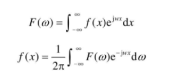
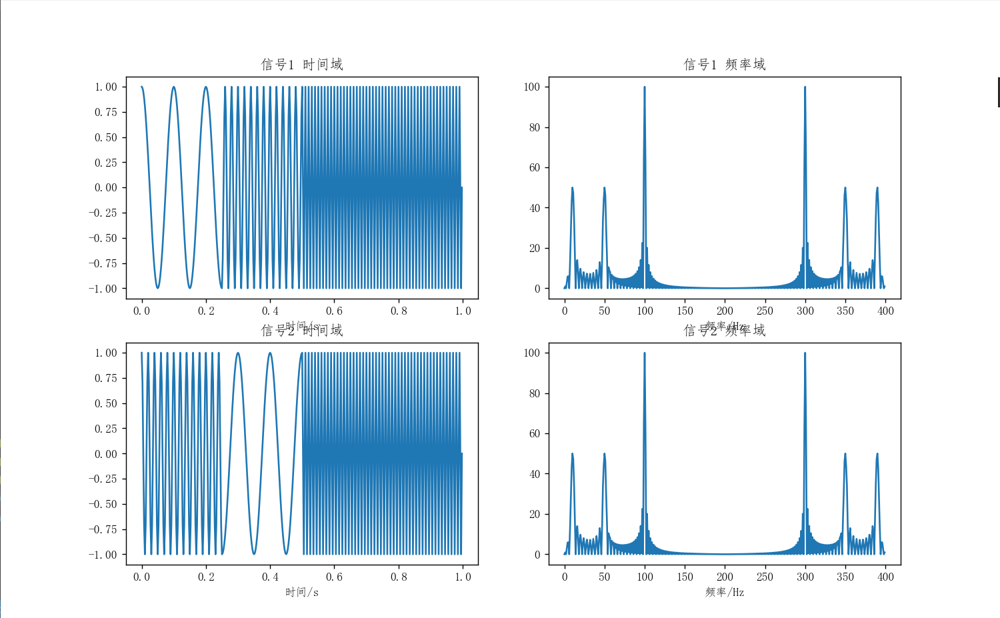
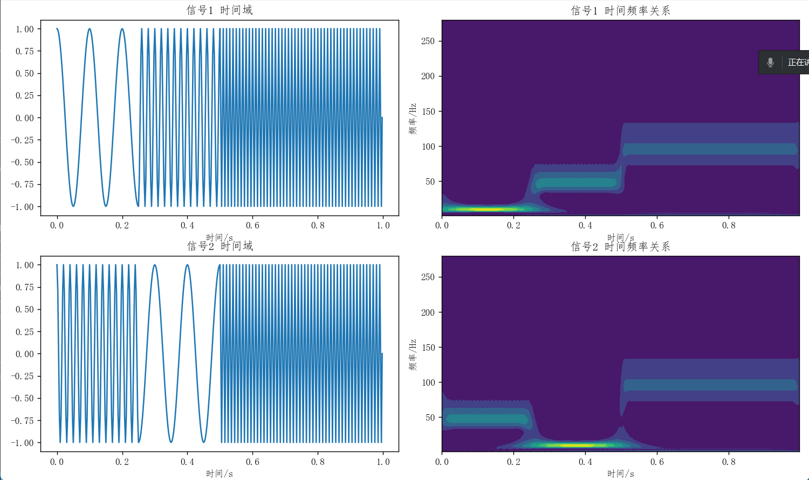
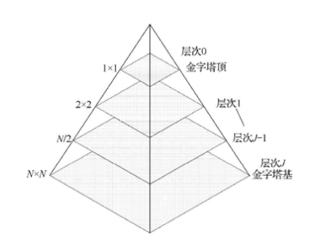
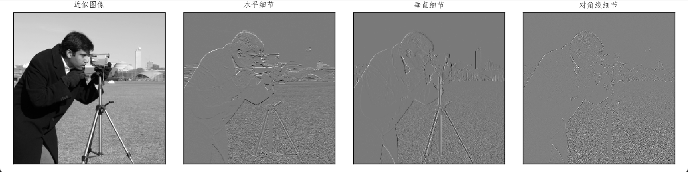
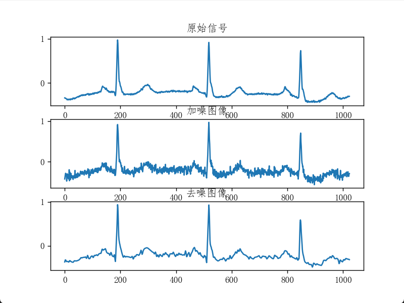
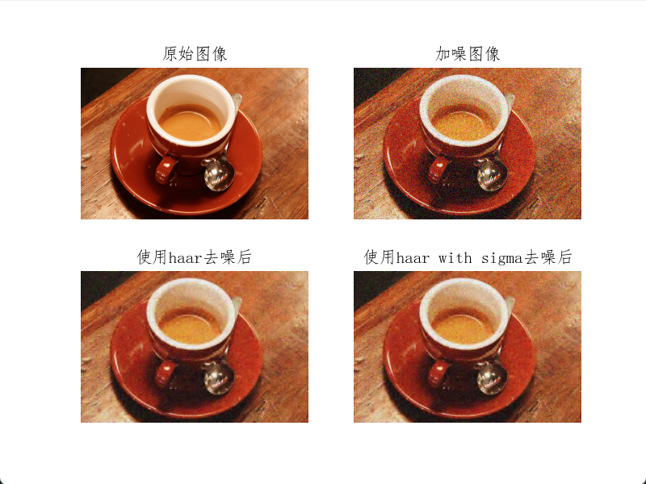

# 图像小波变换与多分辨率

- 小波变换是近年来图像处理中十分受重视的新技术，面向图像压缩、特征检测、纹理分析等提出了很多新方法，如多分辨率分析、时频域分析、金字塔算法等，都属于小波变换的范畴。
- 信号分析是为了时间和频率之间的相互关系。傅里叶变换提供了有关频域的信息，但有关时间的局部化信息却基本丢失。与傅里叶变换不同，小波变换是通过缩放母小波（Mother Wavelet）的宽度获得信号的频域特征，通过平移母小波获得信号的时间信息。对母小波的缩放和平移是为了计算小波系数，这些小波系数反映了小波和局部信号之间的相关程度。
- 像傅里叶分析一样，小波分析就是把一个信号分解为将母小波经过缩放和平移之后的一系列小波，因此小波是小波变换的基函数。小波变换可以理解为用经过缩放和平移的一系列小波函数，代替傅里叶变换的正弦波和余弦波进行傅里叶变换的结果。
- 小波变换中的 `小`是指在时域具有紧支集或近似紧支集，`波`是指具有正负交替的波动性，直流分量为 0。小波本质上是定义在有限间隔而且其平均值为 0 的一种函数。
- 与傅里叶变换相比，小波变换是空间（时间）和频率的局部变换，通过伸缩平移运算，对信号逐步进行多尺度细化，最终达到高频处时间细分，低频处频率细分，能自动适应时频信号分析的要求，从而可聚焦到信号的任意细节。
- 小波变换是基于具有变化的频率和有限持续时间的小型波进行的。

## 1 从傅里叶变换到小波变换

### 1.1 小波

#### 小波的概念

- 小波是在有限时间范围内变化且其平均值为 0 的数学函数。具有两个特点。（1）具有有限的持续时间和突变的频率和振幅。（2）在有限的时间范围内，它的平均值为 0
- 小波变换的结果为各种小波系数，这些系数由尺度和位移函数组成。

#### 小波变换

- 通过小波对一个信号在空间和时间上进行局部化的一种数学变换，通过平移母小波，捕获到信号信息。通过缩放母小波的宽度捕获到信号的频域特性。对母小波的平移和缩放操作是为计算小波分量的系数，这些系数代表局部信号和小波之间的相互关系，这些参数反映了信号的时间属性和频率属性。

### 1.2 感性认识小波变换

- 傅里叶变换一直是信号处理领域应用最广泛、效果最好的一种分析手段，是时域到频域互相转化的工具。从物理意义上，傅里叶变换的实质是把对原函数的研究转化为对其傅里叶变换的研究。但是，傅里叶变换只能提供信号在整个时域上的频率，不能提供信号在某个局部时间段上的频率信息。
- 傅里叶变换：在时域的常量函数，在频域将表现为冲击函数，表明具有很好的频域局部化性质。
  

```python
import numpy as np
import matplotlib.pyplot as plt
from scipy.fftpack import fft

# 中文显示工具函数
def set_ch():
    from pylab import mpl
    mpl.rcParams['font.sans-serif'] = ['FangSong']
    mpl.rcParams['axes.unicode_minus'] = False

set_ch()
t = np.linspace(0, 1, 400, endpoint=False)
cond = [t < 0.25, (t >= 0.25) & (t < 0.5), t >= 0.5]
f1 = lambda t: np.cos(2 * np.pi * 10 * t)
f2 = lambda t: np.cos(2 * np.pi * 50 * t)
f3 = lambda t: np.cos(2 * np.pi * 100 * t)
y1 = np.piecewise(t, cond, [f1, f2, f3])
y2 = np.piecewise(t, cond, [f2, f1, f3])
Y1 = abs(fft(y1))
Y2 = abs(fft(y2))

plt.figure(figsize=(12, 9))

plt.subplot(221)
plt.plot(t, y1)
plt.title('信号1 时间域')
plt.xlabel('时间/s')

plt.subplot(222)
plt.plot(range(400), Y1)
plt.title('信号1 频率域')
plt.xlabel('频率/Hz')

plt.subplot(223)
plt.plot(t, y2)
plt.title('信号2 时间域')
plt.xlabel('时间/s')

plt.subplot(224)
plt.plot(range(400), Y2)
plt.title('信号2 频率域')
plt.xlabel('频率/Hz')

plt.show()


```

- 从时域上看，相差很大的两个信号，在频域上却非常相近。一个很自然的方法是加窗（短时距傅里叶变换），将长时间信号分成数个较短的等长信号，然后再分别对每个窗进行傅里叶变换，从而得到频率随时间的变化，这就是短时距傅里叶变换
  
- 小波变换可以解决这个问题。

```python
import numpy as np
import matplotlib.pyplot as plt
import pywt

# 中文显示工具函数
def set_ch():
    from pylab import mpl
    mpl.rcParams['font.sans-serif'] = ['FangSong']
    mpl.rcParams['axes.unicode_minus'] = False

set_ch()
t = np.linspace(0, 1, 400, endpoint=False)
cond = [t < 0.25, (t >= 0.25) & (t < 0.5), t >= 0.5]

f1 = lambda t: np.cos(2 * np.pi * 10 * t)
f2 = lambda t: np.cos(2 * np.pi * 50 * t)
f3 = lambda t: np.cos(2 * np.pi * 100 * t)

y1 = np.piecewise(t, cond, [f1, f2, f3])
y2 = np.piecewise(t, cond, [f2, f1, f3])

cwtmatr1, freqs1 = pywt.cwt(y1, np.arange(1, 200), 'cgau8', 1 / 400)
cwtmatr2, freqs2 = pywt.cwt(y2, np.arange(1, 200), 'cgau8', 1 / 400)

plt.figure(figsize=(12, 9))

plt.subplot(221)
plt.plot(t, y1)
plt.title('信号1 时间域')
plt.xlabel('时间/s')

plt.subplot(222)
plt.contourf(t, freqs1, abs(cwtmatr1))
plt.title('信号1 时间频率关系')
plt.xlabel('时间/s')
plt.ylabel('频率/Hz')

plt.subplot(223)
plt.plot(t, y2)
plt.title('信号2 时间域')
plt.xlabel('时间/s')

plt.subplot(224)
plt.contourf(t, freqs2, abs(cwtmatr2))
plt.title('信号2 时间频率关系')
plt.xlabel('时间/s')
plt.ylabel('频率/Hz')

plt.tight_layout()
plt.show()


```

- 图中不仅可以看到信号中有哪些频率，还可以看到不同的频率成分在什么时间出现。傅里叶变换类似棱镜，可以将不同的信号分解。小波变换类似于显微镜，不仅知道信号中有哪些成分，还可以知道各种成分在什么位置出现。
  
- 经典的傅里叶变换把信号按正弦、余弦展开，将任意函数表示为具有不同频率的谐波函数的线性叠加，能较好的刻画信号的频率特性。但在时空域上无任何分辨，不能做局部分析。
- 小波分析优于傅里叶分析之处在于：小波分析在时域和频域同时具有良好的局部化性质，因为小波函数是紧支集，而正弦、余弦的区间是无穷区间，所以小波变换可以对高频成分采用逐渐精细的时域或空域取代步长。，从而可以聚焦到对象的任意细节。

## 2 简单小波示例

### 2.1 哈尔小波构建

- 哈尔基函数可以捕捉到信号的尺度信息，而哈尔小波函数信号的细节信息。哈尔小波变换要做的就是将信号分解到不同的基函数及小波函数上，并求每个函数对应分量的值。
- 哈尔小波具有如下特点：
  （1）哈尔小波在时域是紧支撑的，即其非零区间为\[0,1)
  （2）哈尔小波属于正交小波。
  （3）哈尔小波是对称的。系统的单位冲击响应若具有对称性，则该系统具有线性相位，这对于去除相位失真是非常有利的，哈尔小波是目前唯一一个具有对称性，又是有限支撑的正交小波。
  （4）哈尔小波仅取+1 和-1，计算简单。
  （5）哈尔小波是不连续小波，在实际的信号分析与处理中受到了限制。

## 3 图像多分辨率

### 3.1 小波多分辨率

- 多分辨分析是小波分析中最重要的概念之一，将一个函数表示为一个低频成分与不同分辨率下的高频成分，并且多分辨分析能提供一种构造小波的统一框架，提供函数分解与重构的快速算法。
- 单调性。
- 伸缩性。
- 平移不变性。
- Riesz 基。

### 3.2 图像金字塔

- 当观察图象时，通常看到是相连接的纹理与灰度级相似的区域，它们相互结合形成物体。如果物体的尺寸较小或者对比度不高，通常采用较高的分辨率观察；如果物体的尺寸很大或者对比度很强，只需要较低的分辨率。
- 如果物体的尺寸有大有小，或者对比度有强有弱的情况同时发生，那么，以若干个分辨率对他们进行研究将具有优势。
- 以多分辨率解释图像的一种有效但概念简单的结构是图像金字塔，图像金字塔最初用于机器视觉或者图像压缩，将图像表示为一系列分辨率逐渐降低的集合。
- 多分辨率分析：将信号或图像用多种分辨率层次表示。在某个分辨率层次上难以检测到的特征，可能很容易在其他分辨率特征上检测出来，每层中包含一个近似图像和一个残差图像，多种分辨率层次联合起来可以称为图像金字塔。
  

### 3.3 图像子带编码

- 在子带编码中，一幅图像被分解成一系列频带受限的分量，称为子带。子带可以重组在一起，无失真的重建原始图像。每个子带通过对输入图像进行带通滤波而得到。

## 4 图像小波变换

### 4.1 二维小波变换基础

- 通过小波变换得到 N 个小波系数，而二维离散小波变换输入的是二维矩阵，每个步骤输出的是近似图像，水平细节，垂直细节和对角细节

```python
import numpy as np
import matplotlib.pyplot as plt
import pywt.data

# 中文显示工具函数
def set_ch():
    from pylab import mpl
    mpl.rcParams['font.sans-serif'] = ['FangSong']
    mpl.rcParams['axes.unicode_minus'] = False

set_ch()
original = pywt.data.camera()
# Wavelet transform of image, and plot approximation and details
titles = ['近似图像', '水平细节', '垂直细节', '对角线细节']
coeffs2 = pywt.dwt2(original, 'haar')
LL, (LH, HL, HH) = coeffs2
fig = plt.figure(figsize=(12, 3))
for i, a in enumerate([LL, LH, HL, HH]):
    ax = fig.add_subplot(1, 4, i + 1)
    ax.imshow(a, interpolation="nearest", cmap=plt.cm.gray)
    ax.set_title(titles[i], fontsize=10)
    ax.set_xticks([])
    ax.set_yticks([])
fig.tight_layout()
plt.show()


```

- 基于哈尔小波对图像进行二维小波变换结果
  

### 4.2 小波变换在图像处理中的应用

- 小波变换在图像处理中的应用与傅里叶变换类似，基本方法是：（1）计算一幅图像的二维小波变换，并得到小波系数（2）对小波系数进行修改，保留有效成分，过滤不必要成分（3）使用修改后的小波系数进行图像重建
- 基于小波变换的图像去噪步骤
  （1）图像小波变换。选择一个小波，计算噪声图像的小波系数。
  （2）对细节系数通过阈值进行过滤。选择一个细节系数阈值，并对所有细节系数进行阈值化操作。
  （3）基于阈值化过滤后的细节系数及原始近似系数，使用小波变换对图像进行重建。

```python
import numpy as np
import matplotlib.pyplot as plt
import pywt
from skimage.restoration import denoise_wavelet

# 中文显示工具函数
def set_ch():
    from pylab import mpl
    mpl.rcParams['font.sans-serif'] = ['FangSong']
    mpl.rcParams['axes.unicode_minus'] = False

set_ch()
x = pywt.data.ecg().astype(float) / 256

sigma = .05
x_noisy = x + sigma * np.random.randn(x.size)
x_denoise = denoise_wavelet(x_noisy, sigma=sigma, wavelet='sym4')

plt.subplot(311)
plt.title('原始信号')
plt.plot(x)

plt.subplot(312)
plt.title('加噪图像')
plt.plot(x_noisy)

plt.subplot(313)
plt.title('去噪图像')
plt.plot(x_denoise)

plt.show()

```

- 小波对一维信号去噪
  

```python
import matplotlib.pyplot as plt
from skimage.restoration import (denoise_wavelet, estimate_sigma)
from skimage import data, img_as_float
from skimage.util import random_noise

# 中文显示工具函数


def set_ch():
    from pylab import mpl
    mpl.rcParams['font.sans-serif'] = ['FangSong']
    mpl.rcParams['axes.unicode_minus'] = False


set_ch()
original = img_as_float(data.coffee())

plt.subplot(221)
plt.axis('off')
plt.title('原始图像')
plt.imshow(original)

sigma = 0.2
noisy = random_noise(original, var=sigma ** 2)

plt.subplot(222)
plt.axis('off')
plt.title('加噪图像')
plt.imshow(noisy)

im_haar = denoise_wavelet(noisy, wavelet='db2',
                          channel_axis=-1, convert2ycbcr=True)
plt.subplot(223)
plt.axis('off')
plt.title('使用haar去噪后')
plt.imshow(im_haar)

# 不同颜色通道的噪声平均标准差
sigma_est = estimate_sigma(noisy, channel_axis=-1, average_sigmas=True)
im_haar_sigma = denoise_wavelet(
    noisy, wavelet='db2', channel_axis=-1, convert2ycbcr=True, sigma=sigma_est)
plt.subplot(224)
plt.axis('off')
plt.title('使用haar with sigma去噪后')
plt.imshow(im_haar_sigma)
plt.show()


```

- 二维小波图像去噪
  
