# 频域滤波

<!-- more -->

- 法国数学家傅里叶在 `《热分析理论》`中指出：任何周期函数都可以分解为不同频率的正弦或余弦级数的形式，即傅里叶级数。该方法从本质上完成了空间信息到频域信息的变换，通过变换将空间域信号处理问题转换成频域信号处理问题。
- 傅里叶变换可以将任何周期函数，分解为不同频率的信号成分。
- 频域变换为信号处理提供了不同的思路，有时在空间域无法处理的问题，通过频域变换却非常容易。
- 为了更加有效的对数字图像进行处理，常常需要将原始图像，以某种方式变换到另一个空间，并利用图像在变换空间中特有的性质，对图像信息进行加工，然后再转换回图像空间，就可以得到所需的效果。
- 图像变换是双向的，一般将从图像空间转换到其他空间的操作称为正变换，由其他空间转换到图像空间称为逆变换。
  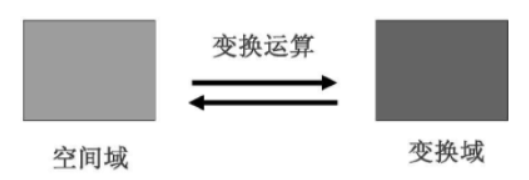
- 傅里叶变换将图像看作二维信号，其水平方向和垂直方向作为二维空间的坐标轴，将图像本身所在的域称为空间域。
- 图像灰度值随空间坐标变换的节奏可以通过频率度量，称为空间频率或者频域。
- 针对数字图像的傅里叶变换是将原始图像通过傅里叶变换转换到频域，然后再频域中对图像进行处理的方法。
- 基于傅里叶变换的数字图像频域处理过程：首先通过正向傅里叶变换将原始图像从空间域转换到频域，然后使用频域滤波器将某些频率过滤，保留某些特定频率，最后使用傅里叶逆变换将滤波后的频域图像重新转换到空间域，得到处理后的图像。
  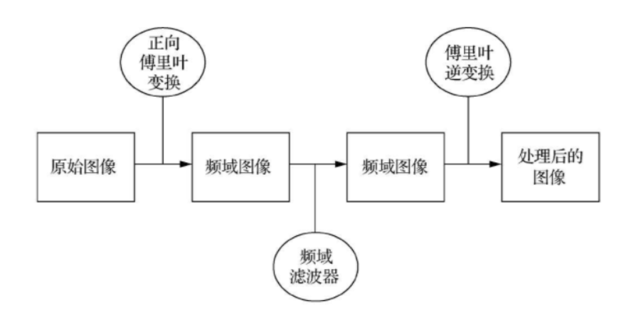
- 相对于空间域图像处理，频域图像处理有以下优点。
  ① 频域图像处理可以通过频域成分的特殊性质，完成一些空间域图像处理难以完成的任务。
  ② 频域图像处理更有利于图像处理的解释，可以对滤波过程中产生的某些效果做出比较直观的解释。
  ③ 频域滤波器可以作为空间滤波器设计的指导，通过傅里叶逆变换可以将频域滤波器转换为空间域变换的操作。通过频域滤波做前期设计，然后在实施阶段，用空间域滤波实现。

## 1 傅里叶变换

- 傅里叶变换是一种常见的正交数学变换，可以将一维信号或函数分解为具有不同频率、不同幅度的正弦信号或余弦信号的组合
- 傅里叶变换的核心贡献在于：如何求出每种正弦波或余弦波的比例或频率，给定每种正弦波或余弦波的频率可以恢复原始信号。
- 一种简单的傅里叶变换
  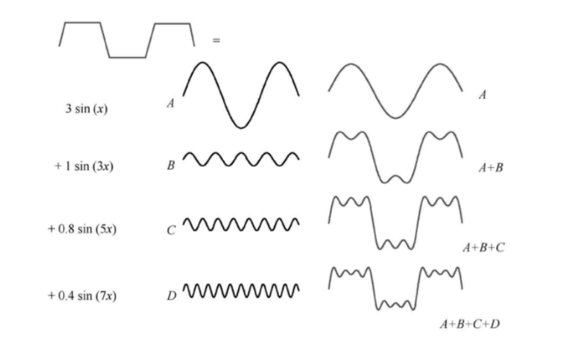

### 1.1 一维傅里叶变换

- 傅里叶变换中，一般要求要求函数 `f(x)`满足狄力克雷条件（在周期内存在有限个间断点）、有限极值条件、绝对可积条件
  $( ∫ − ∞ ∞ ∣ f ( x ) ∣ d x < + ∞ \\int^{\\infty}\_{-\\infty}|f(x)|dx<+\\infty ∫−∞∞∣f(x)∣dx<+∞)$
  只有满足这 3 个条件，函数的傅里叶变换才是存在的。
- 一个函数的傅里叶变换可以表示为
  $F ( u ) = ∫ − ∞ ∞ f ( x ) e − j 2 π u x d x F(u)=\\int\_{-\\infty}^{\\infty}f(x)e^{-j2\\pi ux}dx F(u)\=∫−∞∞f(x)e−j2πuxdx$
  其对应的傅里叶逆变换表示为
  $f ( u ) = ∫ − ∞ ∞ F ( u ) e j 2 π u x d u f(u)=\\int\_{-\\infty}^{\\infty}F(u)e^{j2\\pi ux}du f(u)\=∫−∞∞F(u)ej2πuxdu$
  其中 j = − 1 , u j=\\sqrt{-1},u j\=−1 ,u 为频率分量
- 傅里叶变换中基函数的物理意义非常明确，每个基函数都是一个单频率谐波，对应的系数（又称频谱）表明了原函数在此基函数上投影的大小，或者也可以看作是原函数中此种频率谐波成分的比重。

```python
from matplotlib import pyplot as plt
import numpy as np

# 中文显示工具函数
def set_ch():
    from pylab import mpl
    mpl.rcParams['font.sans-serif'] = ['FangSong']
    mpl.rcParams['axes.unicode_minus'] = False

set_ch()

def show(ori_func, sampling_period=5):
    n = len(ori_func)
    interval = sampling_period / n
    # 绘制原始函数
    plt.subplot(2, 1, 1)
    plt.plot(np.arange(0, sampling_period, interval), ori_func, 'black')
    plt.xlabel('时间'), plt.ylabel('振幅')
    plt.title('原始信号')
    # 绘制变换后的函数
    plt.subplot(2, 1, 2)
    frequency = np.arange(n / 2) / (n * interval)
    nfft = abs(ft[range(int(n / 2))] / n)
    plt.plot(frequency, nfft, 'red')
    plt.xlabel('频率（Hz）'), plt.ylabel('频谱')
    plt.title('傅里叶变换')
    plt.show()

# 生成频率为1，角速度为2*pi的正弦波
time = np.arange(0, 5, .005)
x = np.sin(2 * np.pi * 1 * time)
y = np.fft.fft(x)
show(x, y)


```

- 单一正弦波傅里叶变换结果
  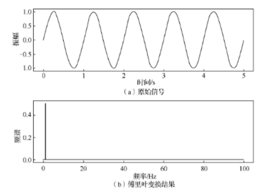

### 1.2 二维傅里叶变换

- 二维傅里叶变换本质上是将一维傅里叶变换情形向二维进行简单扩展。
  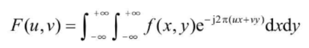
- 对应二维傅里叶变换的逆变换可以表示为：
  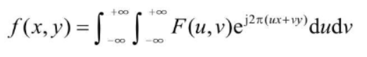

```python
from matplotlib import pyplot as plt
import numpy as np
from skimage import data

# 中文显示工具函数
def set_ch():
    from pylab import mpl
    mpl.rcParams['font.sans-serif'] = ['FangSong']
    mpl.rcParams['axes.unicode_minus'] = False

set_ch()
img = data.camera()
#img = data.checkerboard()
# 快速傅里叶变换得到频率分布
f = np.fft.fft2(img)
# 默认结果中心点的位置是左上角，转移到中间位置
fshift = np.fft.fftshift(f)
# fft结果是复数，求绝对值结果才是振幅
fimg = np.log(np.abs(fshift))
# 展示结果
plt.subplot(1, 2, 1), plt.imshow(img, 'gray'), plt.title('原始图像')
plt.subplot(1, 2, 2), plt.imshow(fimg, 'gray'), plt.title('傅里叶频谱')
plt.show()


```

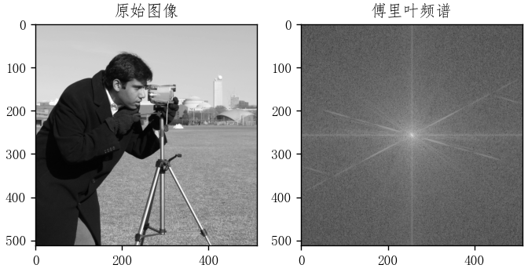

- 棋盘图像对应的傅里叶变换
  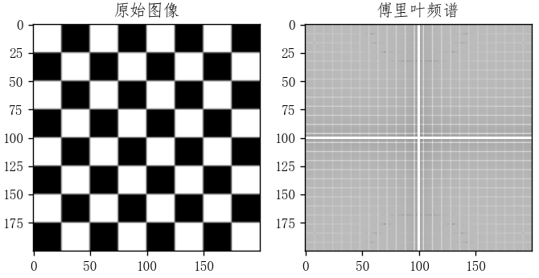
- 图像经傅里叶变换后，直流分量与图像均值成正比，高频分量则表明了图像中目标边缘的强度及方向。

## 2 傅里叶变换的性质

### 2.1 傅里叶变换的基本性质

① 线性特性。傅里叶变换的线性特性可以表示为：若 `f1(t)↔F1(Ω)`，`f2(t)↔F2(Ω)`，则　`af1(t)+bf2(t)↔aF1(Ω)+bF2(Ω)`。其中 `a`、`b`为任意常数，利用傅里叶变换的线性特性，可以将待求信号分解为若干基本信号之和。② 时延特性。时延（移位）特性说明波形在时间轴上时延，并不会改变信号幅度，仅使信号增加 `-Ωt0`线性相位。

- 时延移位对傅里叶频谱的影响。
  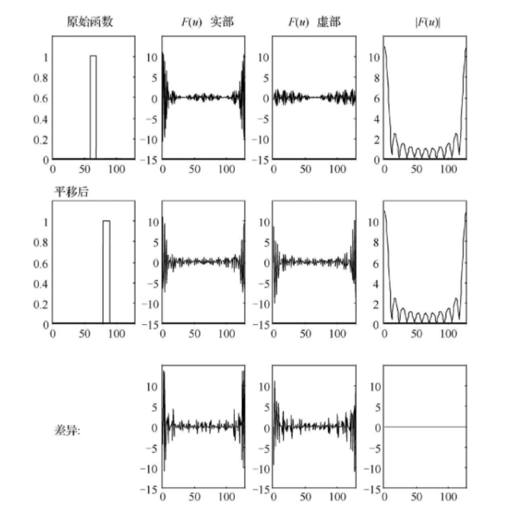

③ 频移特性。频移（调制）特性表明信号在时域中与复因子相乘，则在频域中将使整个频谱搬移 `Ω0`。④ 尺度变换。尺度特性说明，信号在时域中压缩，在频域中扩展；反之，信号在时域中扩展，在频域中就一定压缩，即信号的脉宽与频宽成反比。一般来说，时宽有限的信号，其频宽无限，反之亦然。

- 针对门限函数的尺度变换及其傅里叶变换结果。
  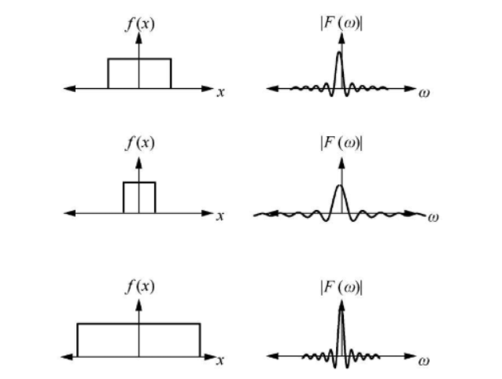
  ⑤ 时域微分特性。
  ⑥ 频域微分特性。
  ⑦ 对称性。
  ⑧ 时域卷积定理。
  ⑨ 频域卷积定理。

### 2.2 二维傅里叶变换的性质

相较于一维傅里叶变换，二维傅里叶变换还具有可分离性，平移特性，旋转特性等。
① 可分离性。
二维离散傅里叶变换（DFT），可视为由沿着 x、y 方向的两个一维傅里叶变换所构成。这一性质可有效降低二维傅里叶变换的计算复杂性。

```python
from matplotlib import pyplot as plt
import numpy as np
from skimage import data, color

# 中文显示工具函数
def set_ch():
    from pylab import mpl
    mpl.rcParams['font.sans-serif'] = ['FangSong']
    mpl.rcParams['axes.unicode_minus'] = False

set_ch()
img_rgb = data.coffee()
img = color.rgb2gray(img_rgb)
# 在X方向实现傅里叶变换
m, n = img.shape
fx = img
for x in range(n):
    fx[:, x] = np.fft.fft(img[:, x])
for y in range(m):
    fx[y, :] = np.fft.fft(img[y, :])
# 默认结果中心点位于左上角，转移到中间位置
fshift = np.fft.fftshift(fx)
# fft结果是复数，求绝对值结果才是振幅
fimg = np.log(np.abs(fshift))
# 展示结果
plt.subplot(121), plt.imshow(img_rgb, 'gray'), plt.title('原始图像')
plt.subplot(122), plt.imshow(fimg, 'gray'), plt.title('两次一维傅里叶变换的图像')
plt.show()


```

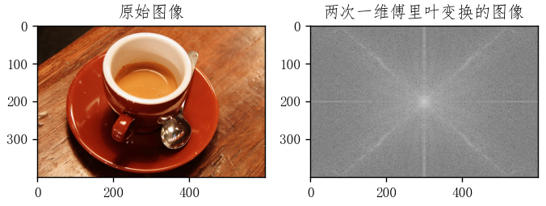
② 平移特性。
`f(x,y)`在空间平移了，相当于把傅里叶变换与一个指数相乘。`f(x,y)`在空间与一个指数项相乘，相当于平移其傅里叶变换。
③ 旋转特性。
对 `f(x,y)`旋转一定角度，相当于将其傅里叶变换 `F(u,v)`旋转一定角度。

## 3 快速傅里叶变换

- 离散傅里叶变换已成为数字信号处理的重要工具，然而其计算量大，运算时间长，使用不够广泛。
- 快速算法大大提高了其运算速度，在某些应用场合已经可以做实时处理，并且应用在控制系统中。
- 快速傅里叶变换不是一种新的变换，是离散傅里叶变换的一种算法，是在分析离散傅里叶变换多余运算的基础上，消除这些重复工作的思想指导下得到的。

### 3.1 快速傅里叶变换的原理

- 离散傅里叶变换的计算时间主要由乘法决定，分解后所需的乘法次数大大减少。
- 利用周期性和分解运算，从而减少乘法运算次数是实现快速运算的关键。

### 3.2 快速傅里叶变换的实现

- 快速傅里叶变换的基本思想：快速傅里叶变换（FFT）基于逐次倍乘法（Successive Doubling Method）
- 这个方法的主要思想是利用傅里叶变换（基底）的性质，将 2M 个数据的傅里叶变换转化为 2 组 M 个数据的傅里叶变换。这样，原来 `4*M*M`的运算量就降低到 `2*M*M`的运算量了。
- 这样就可以将原来比较复杂的傅里叶运算，分解为两个计算较简单的傅里叶运算。且还可以继续分解，如此循环推到下去，直到最后剩下若干组两个点对。

## 4 图像的频域滤波

- 图像变换是对图像信息进行变换，使能量保持但重新分配，以利于加工处理，滤除噪声等不必要的信息，加强、提取感兴趣的部分或特征。
- 傅里叶变换在图像分析、滤波、增强、压缩等处理中有非常重要的应用。
- 假定原图像 `f(x,y)`经傅里叶变换为 `F(u,v)`，频域增强就是选择合适的滤波器函数 `H(u,v)`对 `F(u,v)`的频谱成分进行调整，然后经傅里叶逆变换得到增强的图像 `g(x,y)`
  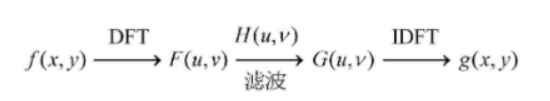
- 可以选择合适的频域传递函数 `H(u,v)`突出 f(x,y)某方面的特征，从而得到需要的图像 `g(x,y)`.例如，利用传递函数突出高频分量，以增强图像的边缘信息，即高通滤波。如果突出低频分量，就可以使图像显得比较平滑，即低通滤波。
- 频域滤波的基本步骤如下。（1）对原始原图像 `f(x,y)`进行傅里叶变换得到 `F(u,v)`（2）将 `F(u,v)`与传递函数 `H(u,v)`进行卷积运算得到 `G(u,v)`（3）将 `G(u,v)`进行傅里叶逆变换得到增强图像 `g(x,y)`
- 频域滤波的核心在于如何确定传递函数。
  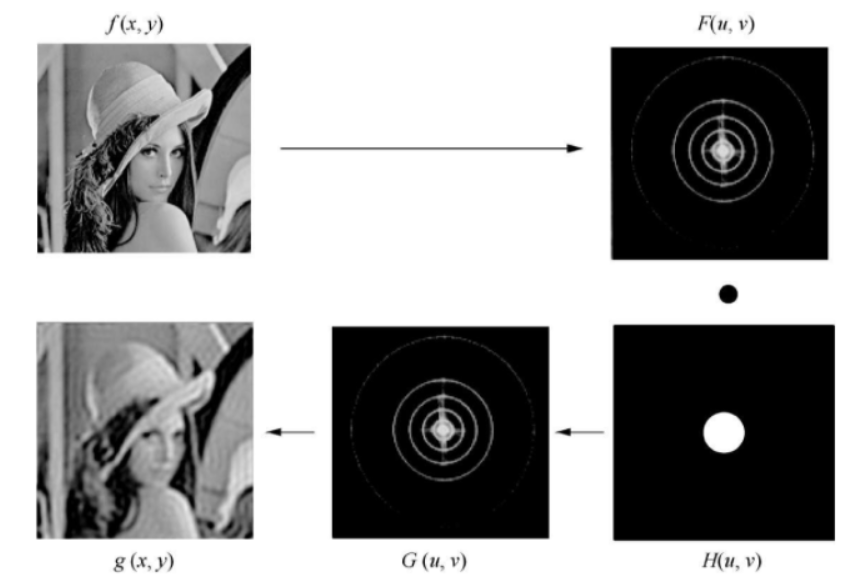

### 4.1 低通滤波

- 图像从空间域变换到频域后，其低频分量对应图像中灰度值变化比较缓慢的区域，高频分量表征物体的边缘和随机噪声等信息。
- 低频滤波是指保留低频分量，而通过滤波器函数 H(u,v)减弱或抑制高频分量，在频域进行滤波。
- 低通滤波与空间域中的平滑滤波器一样，可以消除图像中的随机噪声，减弱边缘效应，起到平滑图像的作用。

#### 第一种 理想低通滤波器

- 二维理想低通滤波器的传递函数如下。
  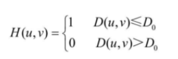
- 理想低通滤波器及其图像
  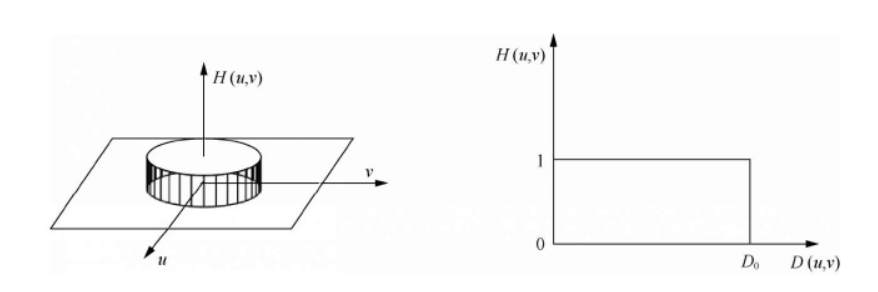

```python
from matplotlib import pyplot as plt
import numpy as np
from skimage import data, color

# 中文显示工具函数
def set_ch():
    from pylab import mpl
    mpl.rcParams['font.sans-serif'] = ['FangSong']
    mpl.rcParams['axes.unicode_minus'] = False

set_ch()
D = 10
new_img = data.coffee()
new_img = color.rgb2gray(new_img)
# 傅里叶变换
f1 = np.fft.fft2(new_img)
# 使用np.fft.fftshift()函数实现平移，让直流分量输出图像的重心
f1_shift = np.fft.fftshift(f1)
# 实现理想低通滤波器
rows, cols = new_img.shape
crow, ccol = int(rows / 2), int(cols / 2)  # 计算频谱中心
mask = np.zeros((rows, cols), dtype='uint8')  # 生成rows行，从cols列的矩阵，数据格式为uint8
# 将距离频谱中心距离小于D的低通信息部分设置为1，属于低通滤波
for i in range(rows):
    for j in range(cols):
        if np.sqrt(i * i + j * j) <= D:
            mask[crow - D:crow + D, ccol - D:ccol + D] = 1
f1_shift = f1_shift * mask
# 傅里叶逆变换
f_ishift = np.fft.ifftshift(f1_shift)
img_back = np.fft.ifft2(f_ishift)
img_back = np.abs(img_back)
img_back = (img_back - np.amin(img_back)) / (np.amax(img_back) - np.amin(img_back))

plt.figure()
plt.subplot(121)
plt.imshow(new_img, cmap='gray')
plt.title('原始图像')

plt.subplot(122)
plt.imshow(img_back, cmap='gray')
plt.title('滤波后的图像')
plt.show()


```

- 二维图像的理想低通滤波
  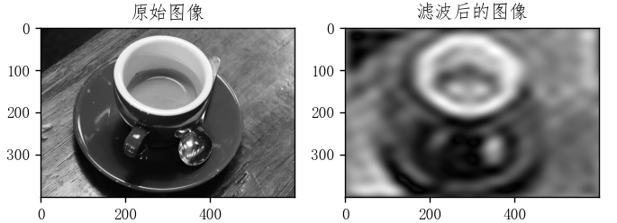

#### 第二种 Butterworth 低通滤波器

- Butterworth 低通滤波器的传递函数为
- 。
- `D0`为截止频率，`n`为函数的阶。一般取使 `H(u,v)`最大值下降到最大值的一半时的 `D(u,v)`为截止频率 `D0`。
- Butterworth 低通滤波器的截面
  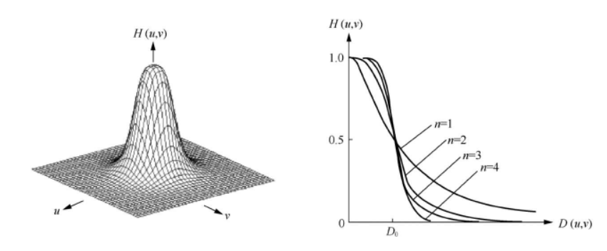
- 与理想低通滤波器相比，高低频之间过度较为平滑，用此滤波器后的输出图像振铃现象不明显。
- n=1 时，过度最平滑，即尾部包含大量的高频成分，所以一阶 Butterworth 低通滤波器没有振铃现象；但随着 n 的增加，振铃现象会越来越明显。

```python
from matplotlib import pyplot as plt
import numpy as np
from skimage import data, color

# 中文显示工具函数
def set_ch():
    from pylab import mpl
    mpl.rcParams['font.sans-serif'] = ['FangSong']
    mpl.rcParams['axes.unicode_minus'] = False

set_ch()
img = data.coffee()
img = color.rgb2gray(img)
f = np.fft.fft2(img)
fshift = np.fft.fftshift(f)
# 取绝对值后将复数变化为实数
# 取对数的目的是将数据变换到0~255
s1 = np.log(np.abs(fshift))

def ButterworthPassFilter(image, d, n):
    """
    Butterworth低通滤波器
    """
    f = np.fft.fft2(image)
    fshift = np.fft.fftshift(f)

    def make_transform_matrix(d):
        transform_matrix = np.zeros(image.shape)
        center_point = tuple(map(lambda x: (x - 1) / 2, s1.shape))
        for i in range(transform_matrix.shape[0]):
            for j in range(transform_matrix.shape[1]):
                def cal_distance(pa, pb):
                    from math import sqrt
                    dis = sqrt((pa[0] - pb[0]) ** 2 + (pa[1] - pb[1]) ** 2)
                    return dis

                dis = cal_distance(center_point, (i, j))
                transform_matrix[i, j] = 1 / (1 + (dis / d) ** (2 * n))
        return transform_matrix

    d_matrix = make_transform_matrix(d)
    new_img = np.abs(np.fft.ifft2(np.fft.ifftshift(fshift * d_matrix)))
    return new_img


plt.subplot(221)
plt.axis('off')
plt.title('Original')
plt.imshow(img, cmap='gray')

plt.subplot(222)
plt.axis('off')
plt.title('Butter D=100 n=1')
butter_100_1 = ButterworthPassFilter(img, 100, 1)
plt.imshow(butter_100_1, cmap='gray')

plt.subplot(223)
plt.axis('off')
plt.title('Butter D=30 n=1')
butter_30_1 = ButterworthPassFilter(img, 30, 1)
plt.imshow(butter_30_1, cmap='gray')

plt.subplot(224)
plt.axis('off')
plt.title('Butter D=30 n=5')
butter_30_5 = ButterworthPassFilter(img, 30, 5)
plt.imshow(butter_30_5, cmap='gray')

plt.show()


```

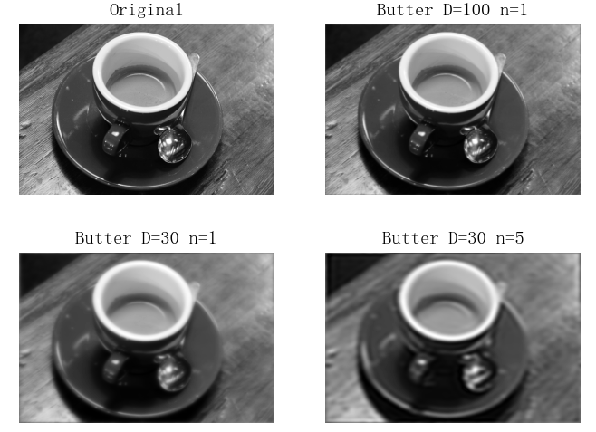

### 4.2 高通滤波

- 图像的边缘、细节主要在高频，图像模糊的原因是高频成分较弱。
- 为了消除模糊，突出边缘，可以采取高通滤波的方法，使低频分量得到抑制，从而达到增强高频分量，使图像的边缘或线条变得清晰，实现图像的锐化。

#### 第一种 理想高通滤波

- 理想高通滤波器的形状与低通滤波器的形状正好相反。
  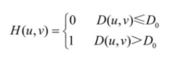
- 理想高通滤波器及其图像
  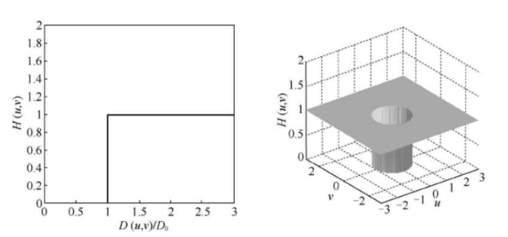

```python
from matplotlib import pyplot as plt
import numpy as np
from skimage import data, color

# 中文显示工具函数
def set_ch():
    from pylab import mpl
    mpl.rcParams['font.sans-serif'] = ['FangSong']
    mpl.rcParams['axes.unicode_minus'] = False

set_ch()
D = 10
new_img = data.coffee()
new_img = color.rgb2gray(new_img)
# numpy 中的傅里叶变换
f1 = np.fft.fft2(new_img)
f1_shift = np.fft.fftshift(f1)
"""
实现理想高通滤波器 start
"""
rows, cols = new_img.shape
# 计算频谱中心
crow, ccol = int(rows / 2), int(cols / 2)
# 生成rows，cols列的矩阵，数据格式为uint8
mask = np.zeros((rows, cols), dtype='uint8')
# 将距离频谱中心距离小于D的低通信息部分设置为1，属于低通滤波
for i in range(rows):
    for j in range(cols):
        if np.sqrt(i * i + j * j) <= D:
            mask[crow - D:crow + D, ccol - D:ccol + D] = 1

mask = 1 - mask
f1_shift = f1_shift * mask
"""
实现理想高通滤波器 end
"""
# 傅里叶逆变换
f_ishift = np.fft.ifftshift(f1_shift)
img_back = np.fft.ifft2(f_ishift)
img_back = np.abs(img_back)
img_back = (img_back - np.amin(img_back)) / (np.amax(img_back) - np.amin(img_back))

plt.figure()
plt.subplot(121)
plt.axis('off')
plt.imshow(new_img, cmap='gray')
plt.title('原始图像')

plt.subplot(122)
plt.axis('off')
plt.imshow(img_back, cmap='gray')
plt.title('过滤后的图像')
plt.show()

```

- 二维图像的理想高通滤波
  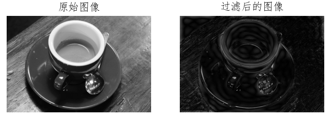

#### 第二种 Butterworth 高通滤波

- Butterworth 高通滤波器的形状与 Butterworth 低通滤波器的形状相反，因为高低频率间平滑过渡，因此振铃现象不明显。
  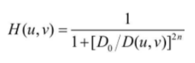

```python
from matplotlib import pyplot as plt
import numpy as np
from skimage import data, color

# 中文显示工具函数
def set_ch():
    from pylab import mpl
    mpl.rcParams['font.sans-serif'] = ['FangSong']
    mpl.rcParams['axes.unicode_minus'] = False

set_ch()
img = data.coffee()
img = color.rgb2gray(img)
f = np.fft.fft2(img)
fshift = np.fft.fftshift(f)
# 取绝对值后将复数变化为实数
# 取对数的目的是将数据变换到0~255
s1 = np.log(np.abs(fshift))

def ButterworthPassFilter(image, d, n):
    """
    Butterworth 高通滤波器
    """
    f = np.fft.fft2(image)
    fshift = np.fft.fftshift(f)

    def make_transform_matrix(d):
        transform_matrix = np.zeros(image.shape)
        center_point = tuple(map(lambda x: (x - 1) / 2, s1.shape))
        for i in range(transform_matrix.shape[0]):
            for j in range(transform_matrix.shape[1]):
                def cal_distance(pa, pb):
                    from math import sqrt
                    dis = sqrt((pa[0] - pb[0]) ** 2 + (pa[1] - pb[1]) ** 2)
                    return dis

                dis = cal_distance(center_point, (i, j))
                transform_matrix[i, j] = 1 / (1 + (dis / d) ** (2 * n))
        return transform_matrix

    d_matrix = make_transform_matrix(d)
    d_matrix = 1 - d_matrix
    new_img = np.abs(np.fft.ifft2(np.fft.ifftshift(fshift * d_matrix)))
    return new_img


plt.subplot(221)
plt.axis('off')
plt.title('Original')
plt.imshow(img, cmap='gray')

plt.subplot(222)
plt.axis('off')
plt.title('Butter D=100 n=1')
butter_100_1 = ButterworthPassFilter(img, 100, 1)
plt.imshow(butter_100_1, cmap='gray')

plt.subplot(223)
plt.axis('off')
plt.title('Butter D=30 n=1')
butter_30_1 = ButterworthPassFilter(img, 30, 1)
plt.imshow(butter_30_1, cmap='gray')

plt.subplot(224)
plt.axis('off')
plt.title('Butter D=30 n=5')
butter_30_5 = ButterworthPassFilter(img, 30, 5)
plt.imshow(butter_30_5, cmap='gray')

plt.show()


```

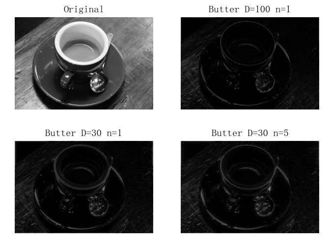

#### 第三种 高频增强滤波器

- 高频滤波将低频分量滤掉，导致增强图像中的边缘得到加强，但平坦区域灰度很暗，接近黑色。
- 高频增强滤波器对频域里的高通滤波器的转移函数加一个常数，将一些低频分量加回去，保持光滑区域的灰度，又改善边缘区域的对比度。
- 高频增强转移函数为 `He(u,v)`\=`k*H(u,v)`+`c`
- 这样就可以做到在原始图像的基础上叠加一些高频成分，既保留了原图的灰度层次，又锐化了边缘

```python
from matplotlib import pyplot as plt
import numpy as np
from skimage import data, color

# 中文显示工具函数
def set_ch():
    from pylab import mpl
    mpl.rcParams['font.sans-serif'] = ['FangSong']
    mpl.rcParams['axes.unicode_minus'] = False

set_ch()
img = data.coffee()
img = color.rgb2gray(img)
f = np.fft.fft2(img)
fshift = np.fft.fftshift(f)
# 取绝对值后将复数变化为实数
# 取对数的目的是将数据变换到0~255
s1 = np.log(np.abs(fshift))

def ButterworthPassFilter(image, d, n):
    """
    Butterworth 高通滤波器
    """
    f = np.fft.fft2(image)
    fshift = np.fft.fftshift(f)

    def make_transform_matrix(d):
        transform_matrix = np.zeros(image.shape)
        center_point = tuple(map(lambda x: (x - 1) / 2, s1.shape))
        for i in range(transform_matrix.shape[0]):
            for j in range(transform_matrix.shape[1]):
                def cal_distance(pa, pb):
                    from math import sqrt
                    dis = sqrt((pa[0] - pb[0]) ** 2 + (pa[1] - pb[1]) ** 2)
                    return dis

                dis = cal_distance(center_point, (i, j))
                transform_matrix[i, j] = 1 / (1 + (dis / d) ** (2 * n))
        return transform_matrix

    d_matrix = make_transform_matrix(d)
    d_matrix = d_matrix+0.5
    new_img = np.abs(np.fft.ifft2(np.fft.ifftshift(fshift * d_matrix)))
    return new_img


plt.subplot(221)
plt.axis('off')
plt.title('Original')
plt.imshow(img, cmap='gray')

plt.subplot(222)
plt.axis('off')
plt.title('Butter D=100 n=1')
butter_100_1 = ButterworthPassFilter(img, 100, 1)
plt.imshow(butter_100_1, cmap='gray')

plt.subplot(223)
plt.axis('off')
plt.title('Butter D=30 n=1')
butter_30_1 = ButterworthPassFilter(img, 30, 1)
plt.imshow(butter_30_1, cmap='gray')

plt.subplot(224)
plt.axis('off')
plt.title('Butter D=30 n=5')
butter_30_5 = ButterworthPassFilter(img, 30, 5)
plt.imshow(butter_30_5, cmap='gray')

plt.show()


```

- 二维图像的高频增强滤波结果
  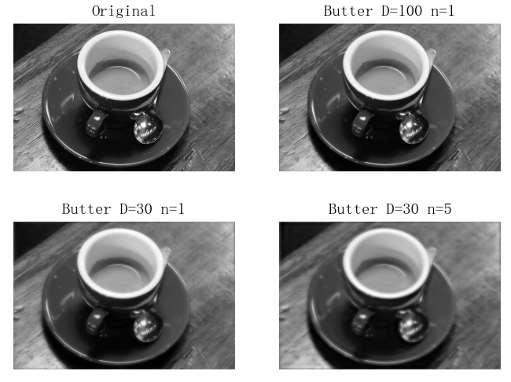
