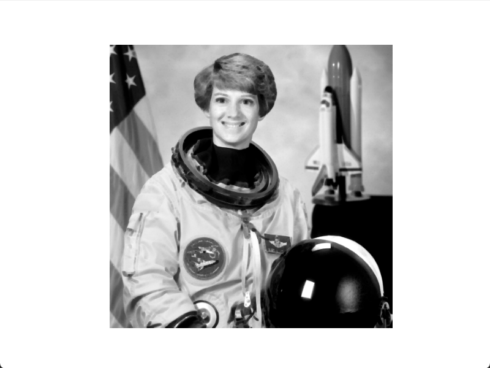
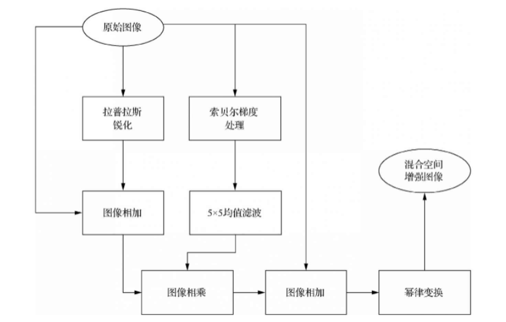

# 空间滤波

<!--more-->

- 空间滤波是在图像平面本身上逐像素的移动空间模板，同时空间模板与其覆盖的图像像素灰度值按预定义的关系进行运算。模板也称空间滤波器、核、掩膜或窗口。
- 空间滤波器一般用于去除图像噪声或增强图像细节，突出感兴趣信息，抑制无效信息，改善人类的视觉效果，或是图像更适合于机器感知或分析。
- 空间滤波主要分为平滑处理和锐化处理两大类。
- 平滑处理主要用于处理图像中一些不重要的细节，并减小噪声。
- 锐化处理主要为了突出图像中的细节，增强图像边缘。
- 为了达到满意的图像增强效果，通常使用多种互补的滤波技术。

## 1 空间滤波基础

- 空间域指的是图像平面本身，是相对于变换域而言的。
- 空间域的图像处理是图像本身不进行频域变换，以图像中的像素为基础对图像进行处理。
- 空间域的图像处理是在像素的领域进行操作，如空间域平滑处理是通过像素的领域平滑图像，空间域锐化处理是通过像素的领域锐化图像。
- 频域的图像处理首先将图像变换到变换域，然后在频域进行处理，处理之后将其变换到空间域。
- 频域处理主要包括 `低通滤波`和 `高通滤波`。
- 低通滤波可以使低频信号正常通过，而高于所设定的临界值的高频信号被阻隔或者减弱，可用于去除图像的噪声，相当于空间域的平滑处理。
- 高通滤波可以使高频信号正常通过，而低于所设定的临界值的低频信号被阻隔或者减弱，可增强图像边缘轮廓等高频信号，相当于空间域的锐化处理。
- 在频域处理中，滤波是指过滤一些频率分量，即通过一些频率分量，同时拒绝一些频率分量的通过。
- 频域滤波器主要包括低通滤波器和高通滤波器。
- 滤波也可用于空间域即空间域滤波，在空间域上直接对图像进行处理，实现类似频域的平滑或锐化处理。

### 1.1 空间滤波的机理

- 空间滤波的机理就是在待处理的图像上逐像素的移动模板，在每个像素点，滤波器的响应通过事先定义的计算。
- 若滤波器在图像像素上执行的是线性操作，则称为线性滤波器，否则称为非线性滤波器。
- 均值滤波器求解的是模板内像素灰度值的平均值，是典型的线性滤波器。
- 统计排序滤波器是通过比较给定邻域内的灰度值大小实现的。原始数据与滤波结果是一种逻辑关系，如最大值滤波器，最小值滤波器，中值滤波器都是典型的非线性滤波器。
- 3\*3 模板的线性空间滤波器的机理
  

* 矩阵进行线性空间滤波处理的代码如下。

```python
from skimage import data, color, io
from matplotlib import pyplot as plt
import numpy as np

def corre12d(img, window):
    m = window.shape[0]
    n = window.shape[1]
    # 边界通过0灰度值填充扩展
    img_border = np.zeros((img.shape[0] + m - 1, img.shape[1] + n - 1))
    img_border[(m - 1) // 2:(img.shape[0] + (m - 1) // 2), (n - 1) // 2:(img.shape[1] + (n - 1) // 2)] = img
    img_result = np.zeros(img.shape)
    for i in range(img_result.shape[0]):
        for j in range(img_result.shape[1]):
            temp = img_border[i:i + m, j:j + n]
            img_result[i, j] = np.sum(np.multiply(temp, window))
    return img_border, img_result

# window表示滤波模板，img表示原始矩阵
window = np.array([[1, 0, 0], [0, 0, 0], [0, 0, 2]])
img = np.array([[1, 2, 1, 0, 2, 3], [0, 1, 1, 2, 0, 1],
                [3, 0, 2, 1, 2, 2], [0, 1, 1, 0, 0, 1],
                [1, 1, 3, 2, 2, 0], [0, 0, 1, 0, 1, 0]])

# img_border表示边界填充后的矩阵，img_result表示空间滤波结果
img_border, img_result = corre12d(img, window)


```

- 矩阵的线性空间滤波过程
  

### 1.2 空间滤波器模板

- `m*n`的线性滤波器模板有 `m*n`个模板系数，这些系数决定了线性空间滤波器的功能。假设要实现 3x3 的平滑空间滤波器，较简单的方法是使得滤波器的系数均为 1/9。
- 模板系数为 1/9 的 3x3 线性空间滤波器模板如下：

```
[1/9, 1/9, 1/9]
[1/9, 1/9, 1/9]
[1/9, 1/9, 1/9]
```

- 模板系数为 1/9 的 5x5 线性空间滤波器模板如下：

```
[1/25, 1/9, 1/25, 1/9, 1/25]
[1/9, 1/9, 1/9, 1/9, 1/9]
[1/25, 1/9, 1/25, 1/9, 1/25]
[1/9, 1/9, 1/9, 1/9, 1/9]
[1/25, 1/9, 1/25, 1/9, 1/25]
```

## 2 平滑处理

- 平滑处理常用于模糊处理和降低噪声。
- 平滑滤波器使用给定邻域内像素的平均灰度值或逻辑运算值代替原始图像中像素的灰度值，这种处理降低了图像灰度的尖锐变化。
- 图像边缘也是由图像灰度尖锐变化带来的特性，因此平滑空间滤波器有边缘模糊化的负面效应。

### 2.1 平滑线性空间滤波器

- 平滑线性空间滤波器的输出是给定邻域内的像素灰度值的简单平均值或加权平均值。
- 平滑线性空间滤波器有时也称均值滤波器，均值滤波器的一个重要应用就是降低图像中的噪声，还有去除图像的不相关细节，使不相关细节与背景糅合在一起，从而使感兴趣目标更加容易检测，此时模板的大小与不相关细节的尺寸有关。

```python
import numpy as np
from scipy import signal
from skimage import data, io
from matplotlib import pyplot as plt


def set_ch():
    from pylab import mpl
    mpl.rcParams['font.sans-serif'] = ['FangSong']
    mpl.rcParams['axes.unicode_minus'] = False


# 定义二维灰度图像的空间滤波函数
def correl2d(img, window):
    """
    使用滤波器实现图像的空间相关
    mode='same' 表示输出尺寸等于输入尺寸
    boundary=‘fill’ 表示滤波前，用常量值填充原始图像的边缘，默认常量值为0

    :param img:
    :param window:
    :return:
    """
    s = signal.correlate2d(img, window, mode='same', boundary='fill')
    return s.astype(np.uint8)


set_ch()
img = data.camera()
# 3*3 盒状滤波模板
window1 = np.ones((3, 3)) / (3 ** 2)
# 5*5 盒状滤波模板
window2 = np.ones((5, 5)) / (5 ** 2)
# 9*9 盒状滤波模板
window3 = np.ones((9, 9)) / (9 ** 2)

# 生成滤波结果
img1 = correl2d(img, window1)
img2 = correl2d(img, window2)
img3 = correl2d(img, window3)

plt.figure()
plt.subplot(221)
plt.axis('off')
plt.title('原始图像')
plt.imshow(img, cmap='gray')

plt.subplot(222)
plt.axis('off')
plt.title('3*3')
plt.imshow(img1, cmap='gray')

plt.subplot(223)
plt.axis('off')
plt.title('5*5')
plt.imshow(img2, cmap='gray')

plt.subplot(224)
plt.axis('off')
plt.title('9*9')
plt.imshow(img3, cmap='gray')
plt.show()


```

- 盒状滤波结果比原始图像的湖面水波更加平滑，并且远处风景更加模糊，同时摄影师也被模糊了
  
- 高斯平滑滤波是一种应用较广泛的平滑空间滤波方法之一

```python


import numpy as np
from scipy import signal
from skimage import data, io
from matplotlib import pyplot as plt
import math

def set_ch():
    from pylab import mpl
    mpl.rcParams['font.sans-serif'] = ['FangSong']
    mpl.rcParams['axes.unicode_minus'] = False

# 定义二维灰度图像的空间滤波函数
def correl2d(img, window):
    """
    使用滤波器实现图像的空间相关
    mode='same' 表示输出尺寸等于输入尺寸
    boundary=‘fill’ 表示滤波前，用常量值填充原始图像的边缘，默认常量值为0

    :param img:
    :param window:
    :return:
    """
    s = signal.correlate2d(img, window, mode='same', boundary='fill')
    return s.astype(np.uint8)

# 定义二维高斯函数
def gauss(i, j, sigma):
    return 1 / (2 * math.pi * sigma ** 2) * math.exp(-(i ** 2 + j ** 2) / (2 * sigma ** 2))

# 定义radius*radius的高斯平滑模板
def gauss_window(radius, sigma):
    window = np.zeros((radius * 2 + 1, radius * 2 + 1))
    for i in range(-radius, radius + 1):
        for j in range(-radius, radius + 1):
            window[i + radius][j + radius] = gauss(i, j, sigma)
    return window / np.sum(window)

set_ch()
img = data.camera()
# 3*3 高斯平滑滤波模板
window1 = gauss_window(3, 1.0)

# 5*5 高斯平滑滤波模板
window2 = gauss_window(5, 1.0)

# 9*9 高斯平滑滤波模板
window3 = gauss_window(9, 1.0)

# 生成滤波结果
img1 = correl2d(img, window1)
img2 = correl2d(img, window2)
img3 = correl2d(img, window3)

plt.figure()
plt.subplot(221)
plt.axis('off')
plt.title('原始图像')
plt.imshow(img, cmap='gray')

plt.subplot(222)
plt.axis('off')
plt.title('3*3')
plt.imshow(img1, cmap='gray')

plt.subplot(223)
plt.axis('off')
plt.title('5*5')
plt.imshow(img2, cmap='gray')

plt.subplot(224)
plt.axis('off')
plt.title('9*9')
plt.imshow(img3, cmap='gray')
plt.show()


```

- 使用相同尺寸的模板，高斯滤波后图像被平滑的程度较低。
- 高斯滤波的输出是邻域像素的加权，同时距离中心越近的像素权重越大。
- 与盒状滤波相比，高斯滤波的平滑效果更柔和，图像中感兴趣目标的细节保留更好。
  

### 2.2 统计排序滤波器

- 统计排序滤波器是典型的非线性平滑滤波器。首先对模板覆盖的灰度值进行排序，选择有代表性的灰度值，作为统计排序滤波器的响应。
- 典型的统计排序滤波器包括最大值滤波器、中值滤波器、最小值滤波器。
- 最大值滤波器用像素邻域内的最大值代替该像素的灰度值，主要用于寻找亮点。
- 中值滤波器用像素邻域内的中值代替该像素的灰度值，主要用于降噪。
- 最小值滤波器用像素邻域内的最小值代替该像素的灰度值，主要用于寻找最暗点。
- 对于一定类型的随机噪声，中值滤波器的降噪效果较好，比相同尺寸的均值滤波器模糊程度明显要低。
- 中值滤波器对处理脉冲噪声非常有效，因为中值滤波器取中值作为滤波结果，可以很好的去除滤波器覆盖的邻域中的一些黑点和白点。
- 中值滤波器使图像中突出的亮点或暗点更像周围的值，以消除孤立的亮点或暗点，从而实现对图像的平滑。
- 为观察中值滤波的降噪效果，首先对宇航员的图像加入脉冲噪声，然后使用 3\*3 中值滤波器对图像进行中值滤波。

```python
from scipy import ndimage
from skimage import util, data
from matplotlib import pyplot as plt

img = data.astronaut()[:, :, 0]
# 对图像加入脉冲噪声
noise_img = util.random_noise(img, mode='s&p', seed=None, clip=True)
# 中值滤波
n = 3
new_img = ndimage.median_filter(noise_img, (n, n))

plt.figure()
plt.axis('off')
plt.imshow(img, cmap='gray')  # 显示原始图像

plt.figure()
plt.axis('off')
plt.imshow(noise_img, cmap='gray')  # 显示加噪图像

plt.figure()
plt.axis('off')
plt.imshow(new_img, cmap='gray')  # 显示去噪图像

plt.show()


```

- 显示原始图像
  
- 显示加噪图像
  
- 显示去噪图像
  
- 对 RGB 图像的空间滤波，相当于分别对 3 个通道的图像进行空间滤波。

```python
from scipy import ndimage
from skimage import util, data
from matplotlib import pyplot as plt
import numpy as np

img = data.astronaut()

noise_img = np.zeros(img.shape)
new_img = np.zeros(img.shape)
for i in range(3):
    gray_img = img[:, :, i]
    # 对图像加入脉冲噪声
    noise_img[:, :, i] = util.random_noise(gray_img, mode='s&p', seed=None, clip=True)
    # 中值滤波
    n = 3
    new_img[:, :, i] = ndimage.median_filter(noise_img[:, :, i], (n, n))

plt.figure()
plt.axis('off')
plt.imshow(img, cmap='gray')  # 显示原始图像

plt.figure()
plt.axis('off')
plt.imshow(noise_img, cmap='gray')  # 显示加噪图像

plt.figure()
plt.axis('off')
plt.imshow(new_img, cmap='gray')  # 显示去噪图像

plt.show()


```

- 原始图像
  
- 加噪图像
  
- 去噪图像
  
- 最大值滤波对于发现图像最亮点非常有效，可有效降低胡椒噪声
- 最小值滤波对于发现图像最暗点非常有效，可有效降低盐粒噪声

```python
from scipy import ndimage
from skimage import util, data
from matplotlib import pyplot as plt
import numpy as np

img = data.astronaut()[:, :, 0]

# 对图像加入胡椒噪声
pepper_img = util.random_noise(img, mode='pepper', seed=None, clip=True)
# 对图像加入盐粒噪声
salt_img = util.random_noise(img, mode='salt', seed=None, clip=True)
n = 3
# 最大值滤波
max_img = ndimage.maximum_filter(pepper_img, (n, n))
# 最小值滤波
min_img = ndimage.minimum_filter(salt_img, (n, n))

plt.figure()
plt.axis('off')
plt.imshow(img, cmap='gray')  # 显示原始图像

plt.figure()
plt.axis('off')
plt.imshow(pepper_img, cmap='gray')  # 显示加胡椒噪声图像

plt.figure()
plt.axis('off')
plt.imshow(salt_img, cmap='gray')  # 显示加盐粒噪声图像

plt.figure()
plt.axis('off')
plt.imshow(max_img, cmap='gray')  # 显示最大值滤波图像

plt.figure()
plt.axis('off')
plt.imshow(min_img, cmap='gray')  # 显示最小值滤波图像

plt.show()


```

- 显示加胡椒噪声图像
  
- 显示加盐粒噪声图像
  
- 显示最大值滤波图像
  
- 显示最小值滤波图像
  

## 3 锐化处理

- 锐化处理的目的就是增强图像中目标的细节、边缘、轮廓和其他灰度突变，削弱了灰度变化缓慢的区域。
- 由于微分是对函数的局部变化率的一种描述，因此图像锐化算法的实现可基于空间微分。
- 图像平滑处理有边缘和细节模糊的负面效应。
- 图像平滑和图像锐化在逻辑上是相反的操作，可以使用原始图像减去平滑处理后的图像实现锐化处理，称为反锐化掩蔽。

### 3.1 一阶微分算子

- 对于任何一阶微分的定义都必须满足以下两点：① 在灰度不变的区域，微分值为 0；② 在灰度变化的区域微分值非 0.由于处理的是离散的情况，微分用差分近似。
- 根据罗伯特的观点，边缘探测器应具有以下特性：产生的边缘应清晰；背景尽可能减少噪声；边缘强度尽可能接近人类的感知。求罗伯特边缘图像和梯度图像的代码如下。

```python
from skimage import data, filters
from matplotlib import pyplot as plt

img = data.camera()
# 罗伯特交叉梯度算子
img_robert_pos = filters.roberts_pos_diag(img)
img_robert_neg = filters.roberts_neg_diag(img)
img_robert = filters.roberts(img)

# 显示原始图像
plt.figure()
plt.imshow(img, cmap='gray')
plt.show()

# 显示罗伯特正对角线边缘图像
plt.figure()
plt.imshow(img, cmap='gray')
plt.show()

# 显示罗伯特负对角线边缘图像
plt.figure()
plt.imshow(img, cmap='gray')
plt.show()

# 显示罗伯特梯度图像
plt.figure()
plt.imshow(img, cmap='gray')
plt.show()

```

- 原始图像
  
- 罗伯特正对角线边缘图像
  
- 罗伯特负对角线边缘图像
  
- 罗伯特梯度图像
  
- 求索贝尔边缘图像和梯度图像的代码如下。

```python
from skimage import data, filters
from matplotlib import pyplot as plt

img = data.camera()
# Sobel算子
img_sobel_h = filters.sobel_h(img)
img_sobel_v = filters.sobel_v(img)
img_sobel = filters.sobel(img)

# 显示原始图像
plt.figure()
plt.imshow(img, cmap='gray')
plt.show()

# 显示水平Sobel边缘图像
plt.figure()
plt.imshow(img_sobel_h, cmap='gray')
plt.show()

# 显示竖直Sobel边缘图像
plt.figure()
plt.imshow(img_sobel_v, cmap='gray')
plt.show()

# 显示Sobel梯度图像
plt.figure()
plt.imshow(img_sobel, cmap='gray')
plt.show()

```

- 水平 Sobel 边缘图像
  
- 竖直 Sobel 边缘图像
  
- Sobel 梯度图像
  

### 3.2 二阶微分算子

- 任意二阶微分的定义都必须满足以下两点：在灰度不变的区域微分值为 0；在灰度台阶或者斜坡的起点处微分值非 0；沿着斜坡的微分值为 0。
- 对原始图像使用拉普拉斯算子进行空间滤波可得到拉普拉斯图像，将拉普拉斯图像以一定的比例叠加到该原始图像，该比例系数的符号与拉普拉斯模板中心系数的符号一致，可对原始图像进行拉普拉斯锐化增强，代码如下。

```python
from skimage import data, filters
from matplotlib import pyplot as plt

img = data.camera()
# laplace
img_laplace = filters.laplace(img, ksize=3, mask=None)
img_enhance = img + img_laplace

# 显示原始图像
plt.figure()
plt.imshow(img, cmap='gray')
plt.show()

# 显示拉普拉斯图像
plt.figure()
plt.imshow(img_laplace, cmap='gray')
plt.show()

# 显示锐化增强图像
plt.figure()
plt.imshow(img_enhance, cmap='gray')
plt.show()


```

- 原始图像
  
- 拉普拉斯图像
  
- 锐化增强图像
  
- 一阶微分更加突出图像的边缘，二阶微分对灰度变化强烈的地方更敏感，更加突出图像的纹理结构。

### 3.3 反锐化掩蔽

- 图像平滑处理有边缘和细节模糊的负面效应，因此可用原始图像减去平滑处理后的图像实现锐化处理，称为反锐化掩蔽。
- 反锐化掩蔽分为 3 个步骤：首先通过平滑滤波得到模糊图像，然后从原始图像中减去差值图像，最后将差值图像叠加到原始图像中。

```python
from skimage import data, filters
from matplotlib import pyplot as plt
from scipy import signal
import numpy as np

def correlate2d(img, window):
    s = signal.correlate2d(img, window, mode='same', boundary='fill')
    return s


img = data.camera()
# 3*3 盒状滤波模板
window = np.ones((3, 3)) / (3 ** 2)
img_blur = correlate2d(img, window)
img_edge = img - img_blur
img_enhance = img + img_edge

# 显示原始图像
plt.figure()
plt.imshow(img, cmap='gray')
plt.show()

# 显示模糊图像
plt.figure()
plt.imshow(img_blur, cmap='gray')
plt.show()

# 显示差值图像
plt.figure()
plt.imshow(img_edge, cmap='gray')
plt.show()

# 显示锐化增强图像
plt.figure()
plt.imshow(img_enhance, cmap='gray')
plt.show()


```

- 模糊图像
  
- 差值图像
  
- 锐化增强图像
  

## 4 混合空间增强

- 混合空间增强就是利用平滑滤波器、锐化滤波器、灰度拉伸等对图像进行处理，得到更为理想的显示效果。
- 由于人体全身骨骼扫描图像的灰度动态范围很窄，并且有很大的噪声内容，因此使用单一的滤波器对其进行增强效果一般。
- 首先使用拉普拉斯锐化方法突出图像中的小细节，然后使用索贝尔梯度处理方法突出图像的边缘，并使用平滑的梯度图像用于掩蔽拉普拉斯锐化增强图像，最后使用灰度幂律变换增强图像的灰度动态范围。
- 人体全身骨骼扫描图像的混合空间增强流程。
  
- 具体流程描述如下：第一步，对原始图像进行拉普拉斯锐化，得到拉普拉斯锐化图像；第二步，将原始图像与拉普拉斯锐化图像相加，得到拉普拉斯锐化图像增强；第三步，对原始图像进行索贝尔算子梯度处理，得到索贝尔图像；第四步，使用 5\*5 均值滤波器对索贝尔图像进行平滑，得到平滑的索贝尔图像；第五步，将拉普拉斯锐化增强图像与平滑索贝尔图像相乘，得到掩蔽图像；第六步，将原始图像与隐蔽图像相加，得到锐化增强图像；第七步，对锐化增强图像进行灰度幂律变换，得到最终结果。

```python
from skimage import data, filters, io
from matplotlib import pyplot as plt
import numpy as np

# 图像空间滤波函数
def correlate2d(img, window):
    m = window.shape[0]
    n = window.shape[1]
    # 边界通过0灰度值填充扩展
    img1 = np.zeros((img.shape[0] + m - 1, img.shape[1] + n - 1))
    img1[(m - 1) // 2:(img.shape[0] + (m - 1) // 2), (n - 1) // 2:(img.shape[1] + (n - 1) // 2)] = img
    img2 = np.zeros(img.shape)
    for i in range(img2.shape[0]):
        for j in range(img2.shape[1]):
            temp = img1[i:i + m, j:j + n]
            img2[i, j] = np.sum(np.multiply(temp, window))
    return img2


img = io.imread('boneScan.jpg', as_gray=True)
# img_laplace为原始图像经过拉普拉斯变换后的结果
window = np.array([[-1, -1, -1], [-1, 8, -1], [-1, -1, -1]])
img_laplace = correlate2d(img, window)
img_laplace = 255 * (img_laplace - img_laplace.min()) / (img_laplace.max() - img_laplace.min())
# 将img与img_laplace相加得到锐化增强图像
img_laplace_enhance = img + img_laplace
# img_sobel为原始图像img经sobel处理的结果
img_sobel = filters.sobel(img)
# 使用5*5均值滤波器平滑后的Sobel图像
window_mean = np.ones((5, 5)) / (5 ** 2)
img_sobel_mean = correlate2d(img_sobel, window_mean)
# 将img_laplace_enhance 与 img_sobel_mean相乘得到锐化结果
img_mask = img_laplace_enhance * img_sobel_mean
# 将原图像img与锐化图像img_mask相加得到锐化增强图像
img_sharp_enhance = img + img_mask
# 对img_sharp_enhance进行灰度幂律变换得到最终结果
img_enhance = img_sharp_enhance ** 0.5

# 显示图像
imgList = [img, img_laplace, img_laplace_enhance, img_sobel, img_sobel_mean, img_mask, img_sharp_enhance, img_enhance]
for grayImg in imgList:
    plt.figure()
    plt.axis('off')
    plt.imshow(grayImg, cmap='gray')
    plt.show()

```


